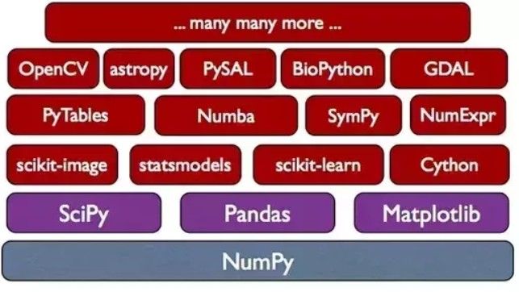

# Fundamentals


## Library Management

### Built-In Libraries


```python
import string
import datetime as dt
```

### Common External Libraries


```python
import numpy as np
import pandas as pd
import datetime as dt

import matplotlib
import matplotlib.pyplot as plt

from plydata import define, query, select, group_by, summarize, arrange, head, rename
import plotnine
from plotnine import *
```

#### numpy
- Large multi-dimensional array and matrices  
- High level mathematical funcitons to operate on them 
- Efficient array computation, modeled after matlab  
- Support vectorized array math functions (built on C, hence faster than python for loop and list)  

#### scipy
- Collection of mathematical algorithms and convenience functions built on the numpy extension  
- Built upon **numpy**

#### Pandas
- Data manipulation and analysis 
- Offer data structures and operations for manipulating numerical tables and time series  
- Good for analyzing tabular data  
- Use for exploratory data analysis, data pre-processing, statistics and visualization
- Built upon **numpy**

#### scikit-learn
- Machine learning functions  
- Built on top of scipy

#### matplotlib
- Data Visualization


### Package Management

### Conda

#### Conda Environment


```r
system("conda info")
```

#### Package Version


```r
system("conda list") 
```

#### Package Installation

Conda is recommended distribution.  

To install from **official** conda channel:

```
conda install <package_name>  # always install latest
conda install <package_name=version_number>

## Example: Install From conda official channel
conda install numpy
conda install scipy
conda install pandas
conda install matpotlib
conda install scikit-learn
conda install seaborn
conda install pip
```

To install from **conda-forge community** channel:

```
conda install -c conda-forge <package_name>
conda install -c conda-forge <package_name=version_number>

## Example: Install From conda community:
conda install -c conda-forge plotnine
```

### PIP

PIP is python open repository (not part of conda). Use **pip** if the package is not available in conda.

#### Package Version


```r
system("pip list")
```

#### Package Installation

```
pip install <package_name>
## Example: pip install plydata
```

## Everything Is Object

- Every varibales in python are **objects**  
- Every variable assginment is **reference based**, that is, each object value is the reference to memory block of data 

In the below exmaple, **a, b and c ** refer to the **same memory location**:  
- Notice when an object assigned to another object, they refer to the same memory location  
- When two variable refers to the same value, they refer to the same memory location


```python
a = 123
b = 123  
c = a
print ('Data of a =',  a,
       '\nData of b =',b,
       '\nData of c =',c,
       '\nID of a = ', id(a),
       '\nID of b = ', id(b),
       '\nID of c = ', id(c)
)
```

```
#:> Data of a = 123 
#:> Data of b = 123 
#:> Data of c = 123 
#:> ID of a =  139904208751072 
#:> ID of b =  139904208751072 
#:> ID of c =  139904208751072
```

Changing data value (using assignment) changes **the reference**


```python
a = 123
b = a
a = 456  # reassignemnt changed a memory reference
         # b memory reference not changed
print ('Data of a =',a,
     '\nData of b =',b,
     '\nID of a = ', id(a),
     '\nID of b = ', id(b)
)
```

```
#:> Data of a = 456 
#:> Data of b = 123 
#:> ID of a =  139903753613424 
#:> ID of b =  139904208751072
```

## Assignment

### Multiple Assignment

Assign multiple variable at the same time with same value.  Note that all object created using this method refer to the **same memory location**.


```python
x = y = 'same mem loc'
print ('x = ', x,
     '\ny = ', y,
     '\nid(x) = ', id(x), 
     '\nid(y) = ', id(y)
)
```

```
#:> x =  same mem loc 
#:> y =  same mem loc 
#:> id(x) =  139903753599600 
#:> id(y) =  139903753599600
```

### Augmented Assignment


```python
x = 1
y = x + 1
y += 1
print ('y = ', y)
```

```
#:> y =  3
```

### Unpacking Assingment

Assign multiple value to multiple variabels at the same time.


```python
x,y = 1,3
print (x,y)
```

```
#:> 1 3
```


# Built-in Data Types

## Numbers
Two types of built-in number type, **integer and float**.

### Integer


```python
n = 123
type (n)
```

```
#:> <class 'int'>
```

### Float


```python
f = 123.4
type (f)
```

```
#:> <class 'float'>
```

### Number Operators

In general, when the operation potentially return **float**, the result is float type. Otherwise it return **integer**.

**Division** always return float


```python
print(4/2)  # return float
```

```
#:> 2.0
```

```python
type(4/2)
```

```
#:> <class 'float'>
```

**Integer Division** by integer return inter. Integer division by float return float.


```python
print (8//3,'\n',    # return int
       8//3.2)       # return float
```

```
#:> 2 
#:>  2.0
```

**Remainder** by integer return **integer**.  
Remainder by float return **float**


```python
print (8%3, '\n',    # return int
       8%3.2)        # return float
```

```
#:> 2 
#:>  1.5999999999999996
```

**Power** return int or float


```python
print (2**3)    # return int
```

```
#:> 8
```

```python
print (2.1**3)  # return float
```

```
#:> 9.261000000000001
```

```python
print (2**3.1)  # return float
```

```
#:> 8.574187700290345
```

## String

String is an object class 'str'. It is an **ordered collection of letters**, an **array** of object type **str**


```python
import string
s = 'abcde'
print( '\nvar type  = ', type(s),
       '\nelems     = ',s[0], s[1], s[2],
       '\nlen       = ', len(s),
       '\nelem type = ',type(s[1]))
```

```
#:> 
#:> var type  =  <class 'str'> 
#:> elems     =  a b c 
#:> len       =  5 
#:> elem type =  <class 'str'>
```

### Constructor

#### Classical Method

```class str(object='')```


```python
my_string = str()        ## empty string
```

```class str(object=b'', encoding='utf-8', errors='strict')```


```python
my_string = str('abc')
```

#### Shortcut Method


```python
my_string = 'abc'
```

#### Multiline Method


```python
my_string = '''
This is me.
Yong Keh Soon
'''
print(my_string)
```

```
#:> 
#:> This is me.
#:> Yong Keh Soon
```
Note that the variable contain **```\n```** front and end of the string.


```python
my_string
```

```
#:> '\nThis is me.\nYong Keh Soon\n'
```


#### Immutability

- String is **immuatable**. Changing its content will result in **error** 


```python
s = 'abcde'
print ('s : ', id(s))
#s[1] = 'z'               # immutable, result in error
```

```
#:> s :  139903753637552
```

- Changing the variable completley change the reference (for new object)


```python
s = 'efgh'
print ('s : ', id(s))
```

```
#:> s :  139903753596272
```

### Class Constants

#### Letters


```python
print( 'letters = ', string.ascii_letters,
        '\nlowercase = ',string.ascii_lowercase,
        '\nuppercase = ',string.ascii_uppercase )
```

```
#:> letters =  abcdefghijklmnopqrstuvwxyzABCDEFGHIJKLMNOPQRSTUVWXYZ 
#:> lowercase =  abcdefghijklmnopqrstuvwxyz 
#:> uppercase =  ABCDEFGHIJKLMNOPQRSTUVWXYZ
```

#### Digits


```python
string.digits
```

```
#:> '0123456789'
```

#### White Spaces


```python
string.whitespace
```

```
#:> ' \t\n\r\x0b\x0c'
```

### Instance Methods

#### Substitution : **```format()```**

**By Positional**


```python
print( '{} + {} = {}'.format('a', 'b', 'c'),         # auto sequence
       '\n{0} + {1} = {2}'.format('aa', 'bb', 'cc')) # manual sequence
```

```
#:> a + b = c 
#:> aa + bb = cc
```

**By Name**


```python
'Coordinates: {latitude}, {longitude}'.format(latitude='37.24N', longitude='-115.81W') ## constant
```

```
#:> 'Coordinates: 37.24N, -115.81W'
```

**By Dictionary Name**


```python
coord = {'latitude': '37.24N', 'longitude': '-115.81W'} ## dictionary key/value
'Coordinates: {latitude}, {longitude}'.format(**coord)
```

```
#:> 'Coordinates: 37.24N, -115.81W'
```

**Formatting Number** 

Float


```python
'{:+f}; {:+f}'.format(3.14, -3.14)  # show it always
```

```
#:> '+3.140000; -3.140000'
```


```python
'{: f}; {: f}'.format(3.14, -3.14)  # show a space for positive numbers
```

```
#:> ' 3.140000; -3.140000'
```


```python
'Correct answers: {:.2f}'.format(55676.345345)
```

```
#:> 'Correct answers: 55676.35'
```

Integer, Percentage


```python
'{0:,}   {0:.2%}   {0:,.2%}'.format(1234567890.4455)
```

```
#:> '1,234,567,890.4455   123456789044.55%   123,456,789,044.55%'
```

**Alignment**


```python
'{0:<20}   {0:<<20}'.format('left aligned')
```

```
#:> 'left aligned           left aligned<<<<<<<<'
```


```python
'{0:>20}  {0:$>20}'.format('right aligned')
```

```
#:> '       right aligned  $$$$$$$right aligned'
```


```python
'{:^30}'.format('centered')  # use '*' as a fill char
```

```
#:> '           centered           '
```

#### Substitution : **```f-string```**


```python
my_name = 'Yong Keh Soon'
salary  = 11123.346
f'Hello, {my_name}, your salary is {salary:,.2f} !'
```

```
#:> 'Hello, Yong Keh Soon, your salary is 11,123.35 !'
```

#### Conversion: ```upper() lower()```


```python
'myEXEel.xls'.upper()
```

```
#:> 'MYEXEEL.XLS'
```


```python
'myEXEel.xls'.lower()
```

```
#:> 'myexeel.xls'
```

#### ```find()``` pattern position
```
string.find() return position of first occurance. -1 if not found
```


```python
s='I love karaoke, I know you love it oo'
print (s.find('lov'))
```

```
#:> 2
```

```python
print (s.find('kemuning'))
```

```
#:> -1
```


#### ```strip()``` off blank spaces


```python
filename = '  myexce l.   xls   '
filename.strip()
```

```
#:> 'myexce l.   xls'
```


#### List Related: ```split()```

Splitting delimeter is specified. Observe the empty spaces were conserved in result array


```python
animals = 'a1,a2 ,a3, a4'
animals.split(',')
```

```
#:> ['a1', 'a2 ', 'a3', ' a4']
```

#### List Related: ```join()```


```python
'-'.join(['1', '2', '3', '4'])
```

```
#:> '1-2-3-4'
```

#### Replacement: `.replace()`


```python
string = "geeks for geeks geeks geeks geeks" 
   
# Prints the string by replacing geeks by Geeks  
print(string.replace("geeks", "Geeks"))  
  
# Prints the string by replacing only 3 occurrence of Geeks   
```

```
#:> Geeks for Geeks Geeks Geeks Geeks
```

```python
print(string.replace("geeks", "GeeksforGeeks", 3)) 
```

```
#:> GeeksforGeeks for GeeksforGeeks GeeksforGeeks geeks geeks
```
 

### Operator

#### ```%``` Old Style Substitution

https://docs.python.org/3/library/stdtypes.html#old-string-formatting


```python
my_name = 'Yong Keh Soon'
salary  = 11123.346
'Hello, %s, your salary is %.2f !' %(my_name, salary)
```

```
#:> 'Hello, Yong Keh Soon, your salary is 11123.35 !'
```

#### ```+``` Concatenation


```python
'this is ' + 'awesome'
```

```
#:> 'this is awesome'
```

#### ```in```  matching

For single string, **partial match**


```python
print( 'abc' in '123abcdefg' )
```

```
#:> True
```

For list of strings, **exact match** (even though only one element in list).  
For partial match, workaround is to **convert list to single string**


```python
print( 'abc' in ['abcdefg'],             # false
       'abc' in ['abcdefg','123'],       # fakse
       'abc' in ['123','abc','def'],     # true
       'abc' in str(['123','abcdefg']))  # true
```

```
#:> False False True True
```

#### Comparitor

Comparitor compares the memory address.


```python
a='abc'
b='abc'
print('id(a) = ', id(a), 
      '\nid(b) = ', id(b),
      '\na == b  ', a==b)
```

```
#:> id(a) =  139904199793840 
#:> id(b) =  139904199793840 
#:> a == b   True
```

### Iterations
```
string[start:end:step]  # default start:0, end:last, step:1
```
If step is negative (reverse), end value must be lower than start value


```python
s = 'abcdefghijk'
print (s[0])       # first later
```

```
#:> a
```

```python
print (s[:3])      # first 3 letters
```

```
#:> abc
```

```python
print (s[2:8 :2])  # stepping
```

```
#:> ceg
```

```python
print (s[-1])      # last letter
```

```
#:> k
```

```python
print (s[-3:])     # last three letters
```

```
#:> ijk
```

```python
print (s[:   :-1]) # reverse everything
```

```
#:> kjihgfedcba
```

```python
print (s[8:2 :-1])
```

```
#:> ihgfed
```

```python
print (s[8:2])     # return NOTHING
```


## Boolean


```python
b = False

if (b):
    print ('It is true')
else:
    print ('It is fake')
```

```
#:> It is fake
```

### What is Considered False ?

Everything below are false, **anything else are true**


```python
print ( bool(0),      # zero
        bool(None),  # none
        bool(''),    # empty string
        bool([]),    # empty list
        bool(()),    # empty tupple
        bool(False), # False
        bool(2-2))    # expression that return any value above
```

```
#:> False False False False False False False
```

### ```and``` operator

BEWARE !  

- **and** can return different data types  
- If evaluated result is **True**, the last **True Value** is returned (because python need to evaluate up to the last value)  
- If evaluated result is **False**, the first **False Value** will be returned (because python return it immediately when detecting False value)


```python
print (123 and 2 and 1,
       123 and [] and 2)
```

```
#:> 1 []
```

### ```not``` operator


```python
not (True)
```

```
#:> False
```

```python
not (True or False)
```

```
#:> False
```

```python
not (False)
```

```
#:> True
```

```python
not (True and False)
```

```
#:> True
```

```python
~(False)
```

```
#:> -1
```

### ```or``` operator
- **or** can return different data type  
- If evaluated result is True, first **True Value** will be returned  (right hand side value **need not be evaluated**)  
- If evaluated result is False, last **Fasle Value** will be returned (need to evalute all items before concluding False)


```python
print (1 or 2)
```

```
#:> 1
```

```python
print (0 or 1 or 1)
```

```
#:> 1
```

```python
print (0 or () or [])
```

```
#:> []
```


## None

### None is an Object

- None is a Python **object NonType**  
- Any operation to None object will result in **error**  
- For array data with None elements, verification is required to check through iteration to determine if the item is not None. It is very computaionaly heavy 


```python
type(None)
```

```
#:> <class 'NoneType'>
```


```python
t1 = np.array([1, 2, 3, 4, 5])
t2= np.array([1, 2, 3, None, 4, 5])
print( t1.dtype  , '\n\n',    # it's an object
       t2.dtype)
```

```
#:> int64 
#:> 
#:>  object
```

### Comparing None

**Not Prefered Method**


```python
null_variable = None
print( null_variable == None )
```

```
#:> True
```

**Prefered**


```python
print( null_variable is None )
```

```
#:> True
```

```python
print( null_variable is not None )
```

```
#:> False
```

### Operation on None

Any operator (except `is`) on None results in error.


```python
None & None
```

```
#:> Error in py_call_impl(callable, dots$args, dots$keywords): TypeError: unsupported operand type(s) for &: 'NoneType' and 'NoneType'
#:> 
#:> Detailed traceback: 
#:>   File "<string>", line 1, in <module>
```

# Built-In Data Structure

## Tuple

Tuple is an **immutable list**. Any attempt to change/update tuple will return error. It can contain **different types** of object.

Benefits of tuple against List are:
- **Faster** than list
- **Protects** your data against accidental change
- Can be used as key in dictionaries, list can't


### Creating


#### Constructor 


```python
# mylist = [1,2,3]
# print(tuple(mylist))
```

#### Assignment

**With or Without `()` **  

This is a formal syntax for defining tuple, items inside (  ) notation. Assignment although works without `()`, it is not recommended.


```python
t1 = (1,2,3,'o','apple')
t2 = 1,2,3,'o','apple'

print(type(t1), type(t2))
```

```
#:> <class 'tuple'> <class 'tuple'>
```

### Accessing


```python
print( t[1], t[1:3] )
```

### Duplicating

Use normal assignment `=` to duplicate. Reference of the memory address is copied. Data is actually not duplicated in memory.

```python
original = (1,2,3,4,5)
copy_test = original
print(original)
```

```
#:> (1, 2, 3, 4, 5)
```

```python
print(copy_test)
```

```
#:> (1, 2, 3, 4, 5)
```
The copy and original has the same memory location.

```python
print('Original ID: ', id(original))
```

```
#:> Original ID:  139903753534832
```

```python
print('Copy ID:     ', id(copy_test))
```

```
#:> Copy ID:      139903753534832
```

## List

- List is a collection of **ordered** items, where the items **can be different data types**  
- You can pack list of items by placing them into []  
- List is mutable

### Creating List

#### Empty List


```python
empty = []      # literal assignment method
empty = list()  # constructor method
print (empty)
```

```
#:> []
```

#### Literal Assignment

- **Multiple data types** is allowed in a list


```python
[123,'abc',456, None]
```

```
#:> [123, 'abc', 456, None]
```

**Constructor**  

- Note that **list(string)** will split the string into letters


```python
list('hello')
```

```
#:> ['h', 'e', 'l', 'l', 'o']
```

### Accessing Items

**Access specific index number**


```python
food = ['bread', 'noodle', 'rice', 'biscuit','jelly','cake']
print (food[2])  # 3rd item
```

```
#:> rice
```

```python
print (food[-1]) # last item
```

```
#:> cake
```


**Access range of indexes**


```python
print (food[:4])     # first 3 items
```

```
#:> ['bread', 'noodle', 'rice', 'biscuit']
```

```python
print (food[-3:])    # last 3 items
```

```
#:> ['biscuit', 'jelly', 'cake']
```

```python
print (food[1:5])    # item 1 to 4
```

```
#:> ['noodle', 'rice', 'biscuit', 'jelly']
```

```python
print (food[5:2:-1]) # item 3 to 5, reverse order
```

```
#:> ['cake', 'jelly', 'biscuit']
```

```python
print (food[::-1])   # reverse order
```

```
#:> ['cake', 'jelly', 'biscuit', 'rice', 'noodle', 'bread']
```

### Methods

#### Remove Item(s)

Removal of non-existance item will result in error

**Search and remove first matching item**


```python
food = list(['bread', 'noodle', 'rice', 'biscuit','jelly','cake','noodle'])
food.remove('noodle')
print (food)
```

```
#:> ['bread', 'rice', 'biscuit', 'jelly', 'cake', 'noodle']
```

**Remove last item**


```python
food.pop()
```

```
#:> 'noodle'
```

```python
print (food)
```

```
#:> ['bread', 'rice', 'biscuit', 'jelly', 'cake']
```

**Remove item at specific position**


```python
food.pop(1)  # counter start from 0
```

```
#:> 'rice'
```

```python
print(food)
```

```
#:> ['bread', 'biscuit', 'jelly', 'cake']
```


```python
food.remove('jelly')
print(food)
```

```
#:> ['bread', 'biscuit', 'cake']
```

#### Appending Item (s)

**Append One Item**


```python
food.append('jelly')
print (food)
```

```
#:> ['bread', 'biscuit', 'cake', 'jelly']
```

**Append Multiple Items**  **```extend()```** will expand the list/tupple argument and append as multiple items


```python
food.extend(['nand','puff'])
print (food)
```

```
#:> ['bread', 'biscuit', 'cake', 'jelly', 'nand', 'puff']
```


#### Other Methods

**Reversing the order of the items**


```python
food.reverse()
food
```

```
#:> ['puff', 'nand', 'jelly', 'cake', 'biscuit', 'bread']
```

**Locating the Index Number of An Item**


```python
food.index('biscuit')
```

```
#:> 4
```

**Count occurance**


```python
test = ['a','a','a','b','c']
test.count('a')
```

```
#:> 3
```

**Sorting The Order of Items**


```python
food.sort()
print (food)
```

```
#:> ['biscuit', 'bread', 'cake', 'jelly', 'nand', 'puff']
```

### Operator

#### Concatenation

**Concatenating Lists**

Two lists can be concatenanted using '+' operator.


```python
['dog','cat','horse'] + ['elephant','tiger'] + ['sheep']
```

```
#:> ['dog', 'cat', 'horse', 'elephant', 'tiger', 'sheep']
```

### List is Mutable

The reference of list variable won't change after adding/removing its item


```python
food = ['cake','jelly','roti','noodle']
print ('food : ',id(food))
```

```
#:> food :  139903753597728
```

```python
food += ['salad','chicken']
print ('food : ',id(food))
```

```
#:> food :  139903753597728
```

A function is actually an **object**, which reference never change, hence **mutable**


```python
def spam (elem, some_list=['a','b']):
    some_list.append(elem)
    return some_list

print (spam(1,['x']))
```

```
#:> ['x', 1]
```

```python
print (spam(2)) ## second parameter is not passed
```

```
#:> ['a', 'b', 2]
```

```python
print (spam(3)) ##  notice the default was remembered
```

```
#:> ['a', 'b', 2, 3]
```

### Duplicate or Reference

**Use =** : It just copy the refernce. IDs are similar


```python
original = [1,2,3,4,5]
copy_test = original
print('Original ID: ', id(original))
```

```
#:> Original ID:  139903753598368
```

```python
print('Copy ID:     ', id(copy_test))                          
```

```
#:> Copy ID:      139903753598368
```


```python
original[0]=999   ## change original
print(original)
```

```
#:> [999, 2, 3, 4, 5]
```

```python
print(copy_test)  ## copy affected
```

```
#:> [999, 2, 3, 4, 5]
```


**Duplicate A List Object** with **```copy()```**. Resulting IDs are different


```python
original = [1,2,3,4,5]
copy_test = original.copy()
print(original)
```

```
#:> [1, 2, 3, 4, 5]
```

```python
print(copy_test)
```

```
#:> [1, 2, 3, 4, 5]
```


```python
print('Original ID: ', id(original))
```

```
#:> Original ID:  139903753608240
```

```python
print('Copy ID:     ', id(copy_test))
```

```
#:> Copy ID:      139903914202208
```


```python
original[0] = 999  ## change original
print(original)    
```

```
#:> [999, 2, 3, 4, 5]
```

```python
print(copy_test)   ## copy not affected
```

```
#:> [1, 2, 3, 4, 5]
```


**Passing To Function As Reference**


```python
def func(x):
    print (x)
    print('ID in Function:      ', id(x))
    x.append(6)    ## modify the refrence
    
my_list = [1,2,3,4,5]
print('ID outside Function: ', id(my_list))
```

```
#:> ID outside Function:  139903914209360
```

```python
func(my_list)  ## call the function, pass the reference
```

```
#:> [1, 2, 3, 4, 5]
#:> ID in Function:       139903914209360
```

```python
print(my_list) ## content was altered
```

```
#:> [1, 2, 3, 4, 5, 6]
```


### List Is Iterable

#### For Loop


```python
s = ['abc','abcd','bcde','bcdee','cdefg']
for x in s:
    if 'abc' in x:
        print (x)
```

```
#:> abc
#:> abcd
```
#### List Comprehension

This code below is a shorform method of **for loop and if**.


```python
old_list = ['abc','abcd','bcde','bcdee','cdefg']
[x for x in old_list if 'abc' in x]
```

```
#:> ['abc', 'abcd']
```

Compare to traditional version of code below:


```python
new_list = []
old_list = ['abc','abcd','bcde','bcdee','cdefg']
for x in old_list:
    if 'abc' in x:
        new_list.append(x)
        
print( new_list )
```

```
#:> ['abc', 'abcd']
```

### Conversion

Convert mutable list to immutable **tuple** with **```tuple()```**


```python
original = [1,2,3]
original_tuple = tuple(original)
print( id(original),
       id(original_tuple))
```

```
#:> 139903753700928 139903753630976
```

### Built-In Functions Applicable To List

**Number of Elements**


```python
len(food)
```

```
#:> 6
```

**Max Value**


```python
test = [1,2,3,5,5,3,2,1]
m = max(test)
test.index(m)  ## only first occurance is found
```

```
#:> 3
```

## Dictionaries

Dictionary is a list of index-value items.

### Creating dict

#### From Literals

**Simple Dictionary**


```python
animal_counts = { 'cats' : 2, 'dogs' : 5, 'horses':4}
print (animal_counts)
```

```
#:> {'cats': 2, 'dogs': 5, 'horses': 4}
```

```python
print( type(animal_counts) )
```

```
#:> <class 'dict'>
```

**Dictionary with list**


```python
animal_names = {'cats':   ['Walter','Ra'],
                'dogs':   ['Jim','Roy','John','Lucky','Row'],
                'horses': ['Sax','Jack','Ann','Jeep']
               }
animal_names
```

```
#:> {'cats': ['Walter', 'Ra'], 'dogs': ['Jim', 'Roy', 'John', 'Lucky', 'Row'], 'horses': ['Sax', 'Jack', 'Ann', 'Jeep']}
```

#### From Variables


```python
cat_names = ['Walter','Ra','Jim']
dog_names = ['Jim','Roy','John','Lucky','Row']
horse_names= ['Sax','Jack','Ann','Jeep']
animal_names = {'cats': cat_names, 'dogs': dog_names, 'horses': horse_names}
animal_names
```

```
#:> {'cats': ['Walter', 'Ra', 'Jim'], 'dogs': ['Jim', 'Roy', 'John', 'Lucky', 'Row'], 'horses': ['Sax', 'Jack', 'Ann', 'Jeep']}
```

### Accessing dict

#### Get All Keys


```python
print (animal_names.keys())
```

```
#:> dict_keys(['cats', 'dogs', 'horses'])
```

```python
print (sorted(animal_names.keys()))
```

```
#:> ['cats', 'dogs', 'horses']
```

#### Get All Values


```python
print (animal_names.values())
```

```
#:> dict_values([['Walter', 'Ra', 'Jim'], ['Jim', 'Roy', 'John', 'Lucky', 'Row'], ['Sax', 'Jack', 'Ann', 'Jeep']])
```

```python
print (sorted(animal_names.values()))
```

```
#:> [['Jim', 'Roy', 'John', 'Lucky', 'Row'], ['Sax', 'Jack', 'Ann', 'Jeep'], ['Walter', 'Ra', 'Jim']]
```

#### Access value with Specific Key

Use **`[ key ]`** notation. However, this will return **Error** if key does not exist


```python
animal_names['dogs']
```

```
#:> ['Jim', 'Roy', 'John', 'Lucky', 'Row']
```

Use  **`get( key )`** notation. will return None if key does not exist


```python
print (animal_counts.get('cow'))
```

```
#:> None
```

### Dict Is Mutable

#### Update/Append

Use **[key]** notation to **update** o **append** the content of element. 


```python
animal_names['dogs'] = ['Ali','Abu','Bakar']
animal_names
```

```
#:> {'cats': ['Walter', 'Ra', 'Jim'], 'dogs': ['Ali', 'Abu', 'Bakar'], 'horses': ['Sax', 'Jack', 'Ann', 'Jeep']}
```

Use **```clear()```** to erase all elements


```python
animal_names.clear()
```

### Iterating Elements

Loop through **`.items()`**


```python
animal_dict = { 'cats' : 2, 'dogs' : 5, 'horses':4}

for key,val in animal_dict.items():
  print( key, val )
```

```
#:> cats 2
#:> dogs 5
#:> horses 4
```

## Sets

Set is **unordered** collection of **unique items**. Set is **mutable**

### Creation

Set can be declared with `{}`, unlike list creation uses '[]'.


```python
myset = {'a','b','c','d','a','b','e','f','g'}
print (myset) # notice no repetition values
```

```
#:> {'c', 'e', 'b', 'f', 'g', 'd', 'a'}
```

Set can be created from list, and then converted back to list


```python
mylist = ['a','b','c','d','a','b','e','f','g']
myset = set(mylist)
my_unique_list = list(myset)
print (
  'Original List       : ', mylist,
  '\nConvert to set      : ', myset,
  '\nConvert back to list: ', my_unique_list) # notice no repetition values
```

```
#:> Original List       :  ['a', 'b', 'c', 'd', 'a', 'b', 'e', 'f', 'g'] 
#:> Convert to set      :  {'c', 'e', 'b', 'f', 'g', 'd', 'a'} 
#:> Convert back to list:  ['c', 'e', 'b', 'f', 'g', 'd', 'a']
```

### Membership Test


```python
print ('a' in myset)      # is member ?
```

```
#:> True
```

```python
print ('f' not in myset)  # is not member ?
```

```
#:> False
```

### Subset Test
Subset Test : <=  
Proper Subset Test : <


```python
mysubset = {'d','g'}
mysubset <= myset
```

```
#:> True
```

Proper Subset test that the master set **contain at least one element** which is not in the subset


```python
mysubset = {'b','a','d','c','e','f','g'}
print ('Is Subset : ', mysubset <= myset)
```

```
#:> Is Subset :  True
```

```python
print ('Is Proper Subet : ', mysubset < myset)
```

```
#:> Is Proper Subet :  False
```

### Union using `|`


```python
{'a','b','c'} | {'a','e','f'}
```

```
#:> {'c', 'e', 'b', 'f', 'a'}
```

### Intersection using `&`

Any elments that exist in both left and right set


```python
{'a','b','c','d'} & {'c','d','e','f'}
```

```
#:> {'d', 'c'}
```

### Difference using `-`

Remove **right** from **left**


```python
{'a','b','c','d'} - {'c','d','e','f'}
```

```
#:> {'b', 'a'}
```

## range
**range(X)** generates sequence of integer object
```
range (lower_bound, upper_bound, step_size)  
# lower bound is optional, default = 0
# upper bound is not included in result
# step is optional, default = 1
```


**Use list() to convert in order to view actual sequence of data**


```python
r = range(10)     # default lower bound =0, step =1
print (type (r))
```

```
#:> <class 'range'>
```

```python
print (r)
```

```
#:> range(0, 10)
```

```python
print (list(r))
```

```
#:> [0, 1, 2, 3, 4, 5, 6, 7, 8, 9]
```


**More Examples**


```python
print (list(range(2,8)))    # step not specified, default 1
```

```
#:> [2, 3, 4, 5, 6, 7]
```

```python
print ('Odds Number : ' , list(range(1,10,2))) # generate odds number
```

```
#:> Odds Number :  [1, 3, 5, 7, 9]
```


# Control and Loops

## If Statement

### Multiline If.. Statements


```python
price = 102
if price <100:
    print ('buy')
elif price < 110:
    print ('hold')
elif price < 120:
    print ('think about it')
else:
    print ('sell')
```

```
#:> hold
```

```python
print('end of programming')
```

```
#:> end of programming
```

### Single Line If .. Statement

#### if ... In One Statement


```python
price = 70
if price<80: print('buy')
```

```
#:> buy
```

#### Ternary Statemnt

This statement return a value with simple condition


```python
price = 85
'buy' if (price<80) else 'dont buy'
```

```
#:> 'dont buy'
```


## For Loops

### For .. Else Construct

**`else`** is only executed when the for loop **completed all cycles**


```python

mylist = [1,2,3,4,5]

for i in mylist:
  print (i)
else:
  print('Hooray, the loop is completed successfully')
```

```
#:> 1
#:> 2
#:> 3
#:> 4
#:> 5
#:> Hooray, the loop is completed successfully
```

In below exmaple, for loop encountered **`break`**, hence the **`else`** section is not executed.


```python
for i in mylist:
  if i < 4:
    print (i)
  else:
    print('Oops, I am breaking out half way in the loop')
    break
else:
  print('Hooray, the loop is completed successfully')
```

```
#:> 1
#:> 2
#:> 3
#:> Oops, I am breaking out half way in the loop
```
### Loop thorugh 'range'


```python
for i in range (1,10,2):
    print ('Odds Number : ',i) 
```

```
#:> Odds Number :  1
#:> Odds Number :  3
#:> Odds Number :  5
#:> Odds Number :  7
#:> Odds Number :  9
```


### Loop through 'list'

#### Standard For Loop


```python
letters = ['a','b','c','d']
for e in letters:
    print ('Letter : ',e)
```

```
#:> Letter :  a
#:> Letter :  b
#:> Letter :  c
#:> Letter :  d
```


#### List Comprehension

Iterate through existing list, and **build new list** based on condition  
```new_list = [expression(i) for i in old_list]```


```python
s = ['abc','abcd','bcde','bcdee','cdefg']
[x.upper() for x in s]
```

```
#:> ['ABC', 'ABCD', 'BCDE', 'BCDEE', 'CDEFG']
```


Extend list comprehension can be extended with **```if```** condition**  
```new_list = [expression(i) for i in old_list if filter(i)]```


```python
old_list    = ['abc','abcd','bcde','bcdee','cdefg']
matching = [ x.upper() for x in old_list if 'bcd' in x ]
print( matching )
```

```
#:> ['ABCD', 'BCDE', 'BCDEE']
```


### Loop Through 'Dictionary'

Looping through dict will picup **key**


```python
d = {"x": 1, "y": 2}
for key in d:
    print (key, d[key])
```

```
#:> x 1
#:> y 2
```


## Generators


- Generator is lazy, produce items only if asked for, hence more memory efficient
- Generator is **function** with 'yield' instead of 'return'  
- Generator contains one or more yields statement  
- When called, it returns an object (iterator) but **does not start execution** immediately  
- Methods like __iter__() and __next__() are implemented automatically. So we can iterate through the items using **next()**  
- Once the function yields, the **function is paused** and the control is transferred to the caller  
- Local variables and their states are **remembered** between successive calls  
- Finally, when the function **terminates**, **StopIteration** is raised automatically on further calls


### Basic Generator Function
Below example give clear understanding of how generator works


```python
def my_gen():
    n = 1
    print('This is printed first')
    # Generator function contains yield statements
    yield n

    n += 1
    print('This is printed second')
    yield n

    n += 1
    print('This is printed at last')
    yield n
```


```python
a = my_gen()
type(a)
```

```
#:> <class 'generator'>
```


```python
next(a)
```

```
#:> This is printed first
#:> 1
```


```python
next(a)
```

```
#:> This is printed second
#:> 2
```


### Useful Generator Fuction
Generator is only useful when it uses **for-loop**
- for-loop within generator
- for-loop to iterate through a generator


```python
def rev_str(my_str):
    length = len(my_str)
    for i in range(length - 1,-1,-1):
        yield my_str[i]
```


```python
for c in rev_str("hello"):
     print(c)
```

```
#:> o
#:> l
#:> l
#:> e
#:> h
```

### Generator Expression
Use () to create an annonymous generator function


```python
my_list = [1, 3, 6, 10]
a = (x**2 for x in my_list)
```


```python
next(a)
```

```
#:> 1
```


```python
next(a)
```

```
#:> 9
```


```python
sum(a) # sum the power of 6,10
```

```
#:> 136
```


### Compare to Iterator Class


```python
class PowTwo:
    def __init__(self, max = 0):
        self.max = max

    def __iter__(self):
        self.n = 0
        return self

    def __next__(self):
        if self.n > self.max:
            raise StopIteration

        result = 2 ** self.n
        self.n += 1
        return result
```


**Obviously, Generator is more concise and cleaner**


```python
def PowTwoGen(max = 0):
    n = 0
    while n < max:
        yield 2 ** n
        n += 1
```


# Library and Functions
Library are group of functions


## Package Source


### Conda
- Package manager for any language  
- Install binaries


### PIP
- Package manager python only  
- Compile from source  
- Stands for Pip Installs Packages  
- Python's officially-sanctioned package manager, and is most commonly used to install packages published on the **Python Package Index (PyPI)**  
- Both pip and PyPI are governed and supported by the Python Packaging Authority (PyPA).


## Importing Library

There are two methods to import library functions:  

**Standalone Namespace**
```
- import <libName>                        # access function through: libName.functionName
- import <libName> as <shortName>         # access function through: shortName.functionName
```
**Global Namespace**
```
- from   <libName> import *               # all functions available at global namespace
- from   <libName> import <functionName>  # access function through: functionName    
- from   <libName> import <functionName> as <shortFunctionName>  # access function through shortFunctionName
```


### Import Entire Library


#### Import Into Standalone Namespace


```python
import math
math.sqrt(9)
```

```
#:> 3.0
```


Use **as** for aliasing library name. This is useful if you have conflicting library name


```python
import math as m
m.sqrt(9)
```

```
#:> 3.0
```


#### Import Into Global Name Space
All functions in the library accessible through global namespace
```
from <libName> import *
```


### Import Specific Function


```python
from math import sqrt
print (sqrt(9))
```

```
#:> 3.0
```


Use **as** for aliasing function name


```python
from math import sqrt as sq
print (sq(9))
```

```
#:> 3.0
```


### Machine Learning Packages




## Define Function

### Function Arguments
By default, arguments are assigned to function left to right


```python
def myfun(x,y):
    print ('x:',x)
    print ('y:',y)
    
myfun(5,8)
```

```
#:> x: 5
#:> y: 8
```

However, you can also specify the argument assigment during function call


```python
myfun (y=8,x=5)
```

```
#:> x: 5
#:> y: 8
```


Function can have **default argement value**


```python
def myfun(x=1,y=1):  # default argument value is 1
    print ('x:',x)
    print ('y:',y)
    
myfun(5)  # pass only one argument
```

```
#:> x: 5
#:> y: 1
```


### List Within Function

Consider a function is an object, its variable (some_list) is immutable and hence its reference won't change, even data changes


```python
def spam (elem, some_list=[]):
    some_list.append(elem)
    return some_list

print (spam(1))
```

```
#:> [1]
```

```python
print (spam(2))
```

```
#:> [1, 2]
```

```python
print (spam(3))
```

```
#:> [1, 2, 3]
```


### Return Statement


```python
def bigger(x,y):
    if (x>y):
        return x
    else:
        return y
    
print (bigger(5,8))
```

```
#:> 8
```


### No Return Statement
if no **return** statement, python return **None**


```python
def dummy():
    print ('This is a dummy function, return no value')

dummy()
```

```
#:> This is a dummy function, return no value
```


### Return Multiple Value
Multiple value is returned as **tuple**. Use multiple assignment to assign to multiple variable


```python
def minmax(x,y,z):
    return min(x,y,z), max(x,y,z)

a,b = minmax(7,8,9)     # multiple assignment
c   = minmax(7,8,9)     # tuple

print (a,b)
```

```
#:> 7 9
```

```python
print (c)    
```

```
#:> (7, 9)
```


### Passing Function as Argument 
You can pass a function name as an argument to a function


```python
def myfun(x,y,f):
    f(x,y)

myfun('hello',54,print)
```

```
#:> hello 54
```


### Arguments

args is a **tuple**


#### Example 1
Error example, too many parameters passed over to function


#### Example 2
First argument goes to x, remaining goes to args as tuple


```python
def myfun(x,*args):
    print (x)
    print (args)     #tuple
    
myfun(1,2,3,4,5,'abc')
```

```
#:> 1
#:> (2, 3, 4, 5, 'abc')
```


#### Example 3
First argument goes to x, second argument goest to y, remaining goes to args


```python
def myfun(x,y,*args):
    print (x)
    print (y)
    print (args)     #tuple
    
myfun(1,2,3)
```

```
#:> 1
#:> 2
#:> (3,)
```


#### Example 4


```python
def myfun(x,*args, y=9):
    print (x)
    print (y)
    print (args)     #tuple
    
myfun(1,2,3,4,5)
```

```
#:> 1
#:> 9
#:> (2, 3, 4, 5)
```


#### Example 5
All goes to args


```python
def myfun(*args):
    print (args)     #tuple
    
myfun(1,2,3,4,5)
```

```
#:> (1, 2, 3, 4, 5)
```


#### Example 6 Empty args


```python
def myfun(x,y,*args):
    print (x)
    print (y)
    print (args)
    
myfun(1,2)
```

```
#:> 1
#:> 2
#:> ()
```


### keyword arguments
kwargs is a **dictionary**


#### Example 1


```python
def foo(**kwargs):
    print(kwargs)
    
foo(a=1,b=2,c=3)
```

```
#:> {'a': 1, 'b': 2, 'c': 3}
```


#### Example 2


```python
def foo(x,**kwargs):
    print(x)
    print(kwargs)
    
foo(9,a=1,b=2,c=3)
```

```
#:> 9
#:> {'a': 1, 'b': 2, 'c': 3}
```


```python
foo(9) #empty dictionary
```

```
#:> 9
#:> {}
```


#### Example 3


```python
def foo(a,b,c,d=1):
    print(a)
    print(b)
    print(c)
    print(d)
    
foo(**{"a":2,"b":3,"c":4})
```

```
#:> 2
#:> 3
#:> 4
#:> 1
```


### Mixing *args, **kwargs

Always put args **before** kwargs

#### Example 1


```python
def foo(x,y=1,**kwargs):
    print (x)
    print (y)
    print (kwargs)
    
foo(1,2,c=3,d=4)
```

```
#:> 1
#:> 2
#:> {'c': 3, 'd': 4}
```


#### Example 2


```python
def foo(x,y=2,*args,**kwargs):
    print (x)
    print (y)
    print (args)
    print (kwargs)
    
foo(1,2,3,4,5,c=6,d=7)
```

```
#:> 1
#:> 2
#:> (3, 4, 5)
#:> {'c': 6, 'd': 7}
```


# Exception Handling

The try statement works as follows:  
- First, the try clause (the statement(s) between the try and except keywords) is executed  
- If no exception occurs, the except clause is skipped and execution of the try statement is finished  
- If an exception occurs during execution of the try clause, the rest of the clause is skipped. Then if its type matches the exception named after the except keyword, the except clause is executed, and then execution continues after the try statement  
- If an exception occurs which does not match the exception named in the except clause, it is passed on to outer try statements; if no handler is found, it is an unhandled exception and execution stops with a message as shown above  

A try statement may have more than one except clause, to specify handlers for different exceptions. 

## Catching Error

Different exception object has different attributes.


```python
try:
  a = 1 + 'a'
  
## known error  
except TypeError as err:
  print('I know this error !!!!',
        '\n Error: ', err,
        '\n Args:  ', err.args,
        '\n Type:  ', type(err))

## all other error
except Exception as err:
  print( 'Error: ', err,
         '\nArgs:  ', err.args,
         '\nType:  ', type(err))
```

```
#:> I know this error !!!! 
#:>  Error:  unsupported operand type(s) for +: 'int' and 'str' 
#:>  Args:   ("unsupported operand type(s) for +: 'int' and 'str'",) 
#:>  Type:   <class 'TypeError'>
```

## Custom Exception


```python
try:
  raise Exception('bloody', 'hell')  #simulate exception
except Exception as err:
  print( 'Error: ', err,
         '\nArgs:  ', err.args,
         '\nType:  ', type(err))
```

```
#:> Error:  ('bloody', 'hell') 
#:> Args:   ('bloody', 'hell') 
#:> Type:   <class 'Exception'>
```

# Object Oriented Programming

## Defining Class

- Every function within a class **must have** at least one parameter - **self**  
- Use **init** as the constructor function. **init** is optional


```python
class Person:
  wallet = 0  # 
  def __init__(self, myname,money=0):   # constructor
      self.name = myname
      self.wallet=money
      print('I\'m in Person Constructor: {}'.format(myname))
  def say_hi(self):
      print('Hello, my name is : ', self.name)
  def say_bye(self):
      print('Goodbye', Person.ID)
  def take(self,amount):
      self.wallet+=amount
  def balance(self):
      print('Wallet Balance:',self.wallet)
  def MakeCry(self):
      self.Cry()
      
class Kid(Person):
  def __init__(self, myname, money=0):
      print('I\'m in Kid Constructor: {}'.format(myname))
      super().__init__(myname=myname, money=money)
  def Cry(self):
      print('Kid is crying')
```

## Constructor


```python
p1 = Person('Yong')  
```

```
#:> I'm in Person Constructor: Yong
```

```python
p2 = Person('Gan',200)
```

```
#:> I'm in Person Constructor: Gan
```

```python
p3 = Kid('Jolin',50)
```

```
#:> I'm in Kid Constructor: Jolin
#:> I'm in Person Constructor: Jolin
```

## Calling Method


```python
p1.say_hi()
```

```
#:> Hello, my name is :  Yong
```

```python
p1.balance()
```

```
#:> Wallet Balance: 0
```

```python
p3.Cry()
```

```
#:> Kid is crying
```

```python
p3.MakeCry()
```

```
#:> Kid is crying
```


```python
p2.say_hi()
```

```
#:> Hello, my name is :  Gan
```

```python
p2.balance()
```

```
#:> Wallet Balance: 200
```

## Getting Property


```python
p1.wallet
```

```
#:> 0
```


```python
p2.wallet
```

```
#:> 200
```


## Setting Property


```python
p1.wallet = 900
p1.wallet
```

```
#:> 900
```


# Decorator


## Definition
- **Decorator** is a function that accept callable as the **only argument**
- The main purpose of decarator is to **enhance** the program of the decorated function
- It returns a **callable**

## Examples

### Example 1 - Plain decorator function
- Many times, it is useful to register a function elsewhere - for example, registering a task in a task runner, or a functin with signal handler
- **register** is a decarator, it accept **decorated** as the only argument
- foo() and bar() are the **decorated function** of **register**


```python
registry = []

def register(decorated):
    registry.append(decorated)
    return decorated

@register
def foo():
    return 3

@register
def bar():
    return 5
```


```python
registry
```

```
#:> [<function foo at 0x7f3de18b3710>, <function bar at 0x7f3de18b3ef0>]
```


```python
registry[0]()
```

```
#:> 3
```


```python
registry[1]()
```

```
#:> 5
```

### Example 2 - Decorator with Class
- Extending the use case above
- register is the **decarator**, it has only one argument


```python
class Registry(object):
    def __init__(self):
        self._functions = []
    def register(self,decorated):
        self._functions.append(decorated)
        return decorated
    def run_all(self,*args,**kwargs):
        return_values = []
        for func in self._functions:
            return_values.append(func(*args,**kwargs))
        return return_values
```


The decorator will decorate two functions, for both object **a** and **b**


```python
a = Registry()
b = Registry()

@a.register
def foo(x=3):
    return x

@b.register
def bar(x=5):
    return x

@a.register
@b.register
def bax(x=7):
    return x
```

Observe the result


```python
print (a._functions)
```

```
#:> [<function foo at 0x7f3de1891200>, <function bax at 0x7f3de9689e60>]
```

```python
print (b._functions)
```

```
#:> [<function bar at 0x7f3de18914d0>, <function bax at 0x7f3de9689e60>]
```


```python
print (a.run_all())
```

```
#:> [3, 7]
```

```python
print (b.run_all())
```

```
#:> [5, 7]
```


```python
print ( a.run_all(x=9) )
```

```
#:> [9, 9]
```

```python
print ( b.run_all(x=9) )
```

```
#:> [9, 9]
```


# `datetime` Standard Library
This is a built-in library by Python. There is no need to install this library.

## ISO8601

https://en.wikipedia.org/wiki/ISO_8601#Time_zone_designators

### Date Time
```UTC:   "2007-04-05T14:30Z"      #notice Z
GMT+8:  "2007-04-05T12:30+08:00  #notice +08:00
GMT+8:  "2007-04-05T12:30+0800   #notice +0800
GMT+8:  "2007-04-05T12:30+08     #notice +08```

### Date
2019-02-04 #notice no timezone available


## Module Import


```python
from datetime import date     # module for date object
from datetime import time     # module for time object
from datetime import datetime # module for datetime object
from datetime import timedelta
```


## Class
datetime library contain **three class of objects**:  
- **date** (year,month,day)  
- **time** (hour,minute,second)  
- **datetime** (year,month,day,hour,minute,second)  
- **timedelta**: duration between two datetime or date object

## date

### Constructor


```python
print( date(2000,1,1) )
```

```
#:> 2000-01-01
```

```python
print( date(year=2000,month=1,day=1) )
```

```
#:> 2000-01-01
```

```python
print( type(date(year=2000,month=1,day=1)))
```

```
#:> <class 'datetime.date'>
```


### Class Method


#### ```today```
This is **local date** (not UTC)


```python
date.today()
```

```
#:> datetime.date(2020, 11, 20)
```


```python
print( date.today() )
```

```
#:> 2020-11-20
```


#### Convert From ISO ```fromisoformat```
```strptime``` is **not available for date** conversion. It is only for datetime conversion


```python
date.fromisoformat('2011-11-11')
```

```
#:> datetime.date(2011, 11, 11)
```

To convert **non-iso format** date string to date object, **convert to datetime first**, then to date

### Instance Method

#### ```replace()```
- Replace **year/month/day** with specified parameter, non specified params will remain unchange.  
- Example below change only month. You can change year or day in combination


```python
print( date.today() )
```

```
#:> 2020-11-20
```

```python
print( date.today().replace(month=8) )
```

```
#:> 2020-08-20
```

#### ```weekday(), isoweekday()```
For ```weekday()```, Zero being Monday   
For ```isoweekday()```, Zero being Sunday


```python
print( date.today().weekday() )
```

```
#:> 4
```

```python
print( date.today().isoweekday() )
```

```
#:> 5
```


```python
weekdays = ['Mon','Tue','Wed','Thu','Fri','Sat','Sun']
wd = date.today().weekday()
print( date.today(), "is day", wd ,"which is", weekdays[wd] )
```

```
#:> 2020-11-20 is day 4 which is Fri
```

#### Formating with ```isoformat()```
```isoformat()``` return **ISO 8601 String (YYYY-MM-DD)**


```python
date.today().isoformat() # return string
```

```
#:> '2020-11-20'
```

#### Formating with ```strftime```
For complete directive, see below:  
https://docs.python.org/3/library/datetime.html#strftime-strptime-behavior


```python
date.today().strftime("%m/%d")
```

```
#:> '11/20'
```

#### ```isocalendar()```
```isocalendar``` return a 3-tuple, **(ISO year, ISO week number, ISO weekday)**.


```python
date.today().isocalendar() ## return tuple 
```

```
#:> (2020, 47, 5)
```

### Attributes


```python
print( date.today().year )
```

```
#:> 2020
```

```python
print( date.today().month )
```

```
#:> 11
```

```python
print( date.today().day )
```

```
#:> 20
```


## date and datetime

### Constructor


```python
import datetime as dt

print( 
    dt.date(2000,1,1,), '\n',
    dt.datetime(2000,1,1,0,0,0), '\n',
    dt.datetime(year=2000,month=1,day=1,hour=23,minute=15,second=55),'\n',
    type(dt.date(2000,1,1)),'\n',
    type(dt.datetime(2000,1,1,0,0,0)))
```

```
#:> 2000-01-01 
#:>  2000-01-01 00:00:00 
#:>  2000-01-01 23:15:55 
#:>  <class 'datetime.date'> 
#:>  <class 'datetime.datetime'>
```

### Class Method

#### ```now``` and ```today```
Both ```now()``` and ```today()``` return current **system local**  datetime, no timezone


```python
print(  dt.datetime.now(), '\n',
        dt.datetime.now().date())
```

```
#:> 2020-11-20 14:28:25.898918 
#:>  2020-11-20
```


```python
dt.datetime.today()
```

```
#:> datetime.datetime(2020, 11, 20, 14, 28, 25, 906038)
```

#### ```utcnow```


```python
dt.datetime.utcnow()
```

```
#:> datetime.datetime(2020, 11, 20, 20, 28, 25, 916074)
```

#### ```combine()``` date and time

Apply ```datetime.combine()``` module method on both **date and time**  object to get **datetime**


```python
now = dt.datetime.now()
dt.datetime.combine(now.date(), now.time())
```

```
#:> datetime.datetime(2020, 11, 20, 14, 28, 25, 922861)
```

#### Convert from String ```strptime()```

Use **```strptime```** to convert string into **datetime** object

```
%I : 12-hour
%H : 24-hour
%M : Minute
%p : AM/PM
%y : 18
%Y : 2018
%b : Mar
%m : month (1 to 12)
%d : day
```


```python
datetime.strptime('2011-02-25','%Y-%m-%d')
```

```
#:> datetime.datetime(2011, 2, 25, 0, 0)
```


```python
datetime.strptime('9-01-18','%d-%m-%y')
```

```
#:> datetime.datetime(2018, 1, 9, 0, 0)
```


```python
datetime.strptime('09-Mar-2018','%d-%b-%Y')
```

```
#:> datetime.datetime(2018, 3, 9, 0, 0)
```


```python
datetime.strptime('2/5/2018 4:49 PM', '%m/%d/%Y %I:%M %p')
```

```
#:> datetime.datetime(2018, 2, 5, 16, 49)
```

#### Convert from ISO ```fromisoformat```

- ```fromisoformat()``` is intend to be reverse of ```isoformat()```  
-  It actually **not ISO compliance**: when Z or +8 is included at the end of the string, error occur


```python
#s = dt.datetime.now().isoformat()
dt.datetime.fromisoformat("2019-02-05T10:22:33")
```

```
#:> datetime.datetime(2019, 2, 5, 10, 22, 33)
```

### Instance Method

#### ```weekday```


```python
datetime.now().weekday()
```

```
#:> 4
```

#### ```replace```


```python
datetime.now().replace(year=1999)
```

```
#:> datetime.datetime(1999, 11, 20, 14, 28, 25, 988527)
```

#### convert to ```.time()```


```python
datetime.now().time()
```

```
#:> datetime.time(14, 28, 25, 998462)
```

#### Convert to ```.date()```


```python
datetime.now().date()
```

```
#:> datetime.date(2020, 11, 20)
```

#### Convert to String

**```str```**


```python
str( datetime.now() )
```

```
#:> '2020-11-20 14:28:26.024638'
```

**Use ```strftime()```**


```python
dt.datetime.now().strftime('%d-%b-%Y')
```

```
#:> '20-Nov-2020'
```


```python
dt.datetime.utcnow().strftime('%Y-%m-%dT%H:%M:%S.%fZ')  ## ISO 8601 UTC
```

```
#:> '2020-11-20T20:28:26.048793Z'
```

**Use ```isoformat()```**


```python
dt.datetime.utcnow().isoformat()
```

```
#:> '2020-11-20T20:28:26.056107'
```

### Attributes


```python
print( datetime.now().year )
```

```
#:> 2020
```

```python
print( datetime.now().month )
```

```
#:> 11
```

```python
print( datetime.now().day )
```

```
#:> 20
```

```python
print( datetime.now().hour )
```

```
#:> 14
```

```python
print( datetime.now().minute )
```

```
#:> 28
```

## time

### Constructor


```python
print( time(2) )    #default single arugement, hour
```

```
#:> 02:00:00
```

```python
print( time(2,15) ) #default two arguments, hour, minute
```

```
#:> 02:15:00
```

```python
print( time(hour=2,minute=15,second=30) )
```

```
#:> 02:15:30
```

### Class Method
#### ```now()```
There is unfortunately no single function to extract the current time. Use **time()** function of an **datetime** object


```python
datetime.now().time()
```

```
#:> datetime.time(14, 28, 26, 105177)
```

### Attributes


```python
print( datetime.now().time().hour )
```

```
#:> 14
```

```python
print( datetime.now().time().minute )
```

```
#:> 28
```

```python
print( datetime.now().time().second )
```

```
#:> 26
```

## timedelta
- **years** argument is **not supported**  
- Apply timedelta on **datetime** object  
- timedelta **cannot** be applied on **time object**  , because timedelta potentially go beyond single day (24H)


```python
delt = timedelta(days=365,minutes=33,seconds=15)
```


```python
now = datetime.now()
print ('delt+now : ', now+delt)
```

```
#:> delt+now :  2021-11-20 15:01:41.137995
```

# Getting External Data

# `Plydata` (`dplyr` for Python)

## Sample Data


```python
n = 200
comp = ['C' + i for i in np.random.randint( 1,4, size  = n).astype(str)] # 3x Company
dept = ['D' + i for i in np.random.randint( 1,6, size  = n).astype(str)] # 5x Department
grp =  ['G' + i for i in np.random.randint( 1,3, size  = n).astype(str)] # 2x Groups
value1 = np.random.normal( loc=50 , scale=5 , size = n)
value2 = np.random.normal( loc=20 , scale=3 , size = n)
#value3 = np.random.normal( loc=5 , scale=30 , size = n)

mydf = pd.DataFrame({
    'comp':comp, 
    'dept':dept, 
    'grp': grp,
    'value1':value1, 
    'value2':value2
    #'value3':value3 
})
mydf.head()
```

```
#:>   comp dept grp     value1     value2
#:> 0   C1   D5  G2  44.991357  18.376559
#:> 1   C1   D3  G1  42.629061  15.044993
#:> 2   C3   D1  G1  53.803512  18.496985
#:> 3   C2   D3  G1  51.387646  16.152419
#:> 4   C2   D3  G1  52.897552  19.107399
```

## Column Manipulation

### Copy Column


```python
mydf >> define(newcol = 'value1')                 # simple method for one column
```

```
#:>     comp dept grp     value1     value2     newcol
#:> 0     C1   D5  G2  44.991357  18.376559  44.991357
#:> 1     C1   D3  G1  42.629061  15.044993  42.629061
#:> 2     C3   D1  G1  53.803512  18.496985  53.803512
#:> 3     C2   D3  G1  51.387646  16.152419  51.387646
#:> 4     C2   D3  G1  52.897552  19.107399  52.897552
#:> ..   ...  ...  ..        ...        ...        ...
#:> 195   C3   D3  G1  44.837077  23.383648  44.837077
#:> 196   C2   D2  G2  44.899655  17.546987  44.899655
#:> 197   C1   D1  G2  47.806362  21.936824  47.806362
#:> 198   C1   D5  G1  50.837563  17.498985  50.837563
#:> 199   C1   D4  G1  51.282241  20.841696  51.282241
#:> 
#:> [200 rows x 6 columns]
```


```python
mydf >> define (('newcol1', 'value1'), newcol2='value2')  # method for muiltiple new columns
```

```
#:>     comp dept grp     value1     value2    newcol1    newcol2
#:> 0     C1   D5  G2  44.991357  18.376559  44.991357  18.376559
#:> 1     C1   D3  G1  42.629061  15.044993  42.629061  15.044993
#:> 2     C3   D1  G1  53.803512  18.496985  53.803512  18.496985
#:> 3     C2   D3  G1  51.387646  16.152419  51.387646  16.152419
#:> 4     C2   D3  G1  52.897552  19.107399  52.897552  19.107399
#:> ..   ...  ...  ..        ...        ...        ...        ...
#:> 195   C3   D3  G1  44.837077  23.383648  44.837077  23.383648
#:> 196   C2   D2  G2  44.899655  17.546987  44.899655  17.546987
#:> 197   C1   D1  G2  47.806362  21.936824  47.806362  21.936824
#:> 198   C1   D5  G1  50.837563  17.498985  50.837563  17.498985
#:> 199   C1   D4  G1  51.282241  20.841696  51.282241  20.841696
#:> 
#:> [200 rows x 7 columns]
```

<!-- jupyter_markdown,  -->
### New Column from existing Column

<!-- jupyter_markdown,  -->
**Without specify the new column name**, it will be derived from expression


```python
mydf >> define ('value1*2')
```

```
#:>     comp dept grp     value1     value2    value1*2
#:> 0     C1   D5  G2  44.991357  18.376559   89.982715
#:> 1     C1   D3  G1  42.629061  15.044993   85.258122
#:> 2     C3   D1  G1  53.803512  18.496985  107.607023
#:> 3     C2   D3  G1  51.387646  16.152419  102.775291
#:> 4     C2   D3  G1  52.897552  19.107399  105.795104
#:> ..   ...  ...  ..        ...        ...         ...
#:> 195   C3   D3  G1  44.837077  23.383648   89.674153
#:> 196   C2   D2  G2  44.899655  17.546987   89.799311
#:> 197   C1   D1  G2  47.806362  21.936824   95.612724
#:> 198   C1   D5  G1  50.837563  17.498985  101.675127
#:> 199   C1   D4  G1  51.282241  20.841696  102.564482
#:> 
#:> [200 rows x 6 columns]
```

<!-- jupyter_markdown,  -->
**Specify the new column name**


```python
mydf >> define(value3 = 'value1*2')
```

```
#:>     comp dept grp     value1     value2      value3
#:> 0     C1   D5  G2  44.991357  18.376559   89.982715
#:> 1     C1   D3  G1  42.629061  15.044993   85.258122
#:> 2     C3   D1  G1  53.803512  18.496985  107.607023
#:> 3     C2   D3  G1  51.387646  16.152419  102.775291
#:> 4     C2   D3  G1  52.897552  19.107399  105.795104
#:> ..   ...  ...  ..        ...        ...         ...
#:> 195   C3   D3  G1  44.837077  23.383648   89.674153
#:> 196   C2   D2  G2  44.899655  17.546987   89.799311
#:> 197   C1   D1  G2  47.806362  21.936824   95.612724
#:> 198   C1   D5  G1  50.837563  17.498985  101.675127
#:> 199   C1   D4  G1  51.282241  20.841696  102.564482
#:> 
#:> [200 rows x 6 columns]
```

<!-- jupyter_markdown,  -->
Define **multiple** new columns in one go. Observe there are three ways to specify the new columns


```python
mydf >> define('value1*2',('newcol2','value2*2'),newcol3='value2*3')
```

```
#:>     comp dept grp     value1     value2    value1*2    newcol2    newcol3
#:> 0     C1   D5  G2  44.991357  18.376559   89.982715  36.753118  55.129677
#:> 1     C1   D3  G1  42.629061  15.044993   85.258122  30.089985  45.134978
#:> 2     C3   D1  G1  53.803512  18.496985  107.607023  36.993970  55.490955
#:> 3     C2   D3  G1  51.387646  16.152419  102.775291  32.304838  48.457257
#:> 4     C2   D3  G1  52.897552  19.107399  105.795104  38.214799  57.322198
#:> ..   ...  ...  ..        ...        ...         ...        ...        ...
#:> 195   C3   D3  G1  44.837077  23.383648   89.674153  46.767296  70.150944
#:> 196   C2   D2  G2  44.899655  17.546987   89.799311  35.093974  52.640962
#:> 197   C1   D1  G2  47.806362  21.936824   95.612724  43.873649  65.810473
#:> 198   C1   D5  G1  50.837563  17.498985  101.675127  34.997969  52.496954
#:> 199   C1   D4  G1  51.282241  20.841696  102.564482  41.683391  62.525087
#:> 
#:> [200 rows x 8 columns]
```

<!-- jupyter_markdown,  -->
### Select Column(s)


```python
mydf2 = mydf >> define(newcol1='value1',newcol2='value2')
mydf2.info()
```

```
#:> <class 'pandas.core.frame.DataFrame'>
#:> RangeIndex: 200 entries, 0 to 199
#:> Data columns (total 7 columns):
#:>  #   Column   Non-Null Count  Dtype  
#:> ---  ------   --------------  -----  
#:>  0   comp     200 non-null    object 
#:>  1   dept     200 non-null    object 
#:>  2   grp      200 non-null    object 
#:>  3   value1   200 non-null    float64
#:>  4   value2   200 non-null    float64
#:>  5   newcol1  200 non-null    float64
#:>  6   newcol2  200 non-null    float64
#:> dtypes: float64(4), object(3)
#:> memory usage: 11.1+ KB
```

<!-- jupyter_markdown,  -->
#### By Column Names
**Exact Coumn Name**


```python
mydf2 >> select ('comp','dept','value1')
```

```
#:>     comp dept     value1
#:> 0     C1   D5  44.991357
#:> 1     C1   D3  42.629061
#:> 2     C3   D1  53.803512
#:> 3     C2   D3  51.387646
#:> 4     C2   D3  52.897552
#:> ..   ...  ...        ...
#:> 195   C3   D3  44.837077
#:> 196   C2   D2  44.899655
#:> 197   C1   D1  47.806362
#:> 198   C1   D5  50.837563
#:> 199   C1   D4  51.282241
#:> 
#:> [200 rows x 3 columns]
```

**Column Name Starts With** ...


```python
mydf2 >> select ('comp', startswith='val')
```

```
#:>     comp     value1     value2
#:> 0     C1  44.991357  18.376559
#:> 1     C1  42.629061  15.044993
#:> 2     C3  53.803512  18.496985
#:> 3     C2  51.387646  16.152419
#:> 4     C2  52.897552  19.107399
#:> ..   ...        ...        ...
#:> 195   C3  44.837077  23.383648
#:> 196   C2  44.899655  17.546987
#:> 197   C1  47.806362  21.936824
#:> 198   C1  50.837563  17.498985
#:> 199   C1  51.282241  20.841696
#:> 
#:> [200 rows x 3 columns]
```

**Column Name Ends With ...**


```python
mydf2 >> select ('comp',endswith=('1','2','3'))
```

```
#:>     comp     value1     value2    newcol1    newcol2
#:> 0     C1  44.991357  18.376559  44.991357  18.376559
#:> 1     C1  42.629061  15.044993  42.629061  15.044993
#:> 2     C3  53.803512  18.496985  53.803512  18.496985
#:> 3     C2  51.387646  16.152419  51.387646  16.152419
#:> 4     C2  52.897552  19.107399  52.897552  19.107399
#:> ..   ...        ...        ...        ...        ...
#:> 195   C3  44.837077  23.383648  44.837077  23.383648
#:> 196   C2  44.899655  17.546987  44.899655  17.546987
#:> 197   C1  47.806362  21.936824  47.806362  21.936824
#:> 198   C1  50.837563  17.498985  50.837563  17.498985
#:> 199   C1  51.282241  20.841696  51.282241  20.841696
#:> 
#:> [200 rows x 5 columns]
```

**Column Name Contains ...**


```python
mydf2 >> select('comp', contains=('col','val'))
```

```
#:>     comp     value1     value2    newcol1    newcol2
#:> 0     C1  44.991357  18.376559  44.991357  18.376559
#:> 1     C1  42.629061  15.044993  42.629061  15.044993
#:> 2     C3  53.803512  18.496985  53.803512  18.496985
#:> 3     C2  51.387646  16.152419  51.387646  16.152419
#:> 4     C2  52.897552  19.107399  52.897552  19.107399
#:> ..   ...        ...        ...        ...        ...
#:> 195   C3  44.837077  23.383648  44.837077  23.383648
#:> 196   C2  44.899655  17.546987  44.899655  17.546987
#:> 197   C1  47.806362  21.936824  47.806362  21.936824
#:> 198   C1  50.837563  17.498985  50.837563  17.498985
#:> 199   C1  51.282241  20.841696  51.282241  20.841696
#:> 
#:> [200 rows x 5 columns]
```

#### Specify Column Range


```python
mydf2 >> select ('comp', slice('value1','newcol2'))
```

```
#:>     comp     value1     value2    newcol1    newcol2
#:> 0     C1  44.991357  18.376559  44.991357  18.376559
#:> 1     C1  42.629061  15.044993  42.629061  15.044993
#:> 2     C3  53.803512  18.496985  53.803512  18.496985
#:> 3     C2  51.387646  16.152419  51.387646  16.152419
#:> 4     C2  52.897552  19.107399  52.897552  19.107399
#:> ..   ...        ...        ...        ...        ...
#:> 195   C3  44.837077  23.383648  44.837077  23.383648
#:> 196   C2  44.899655  17.546987  44.899655  17.546987
#:> 197   C1  47.806362  21.936824  47.806362  21.936824
#:> 198   C1  50.837563  17.498985  50.837563  17.498985
#:> 199   C1  51.282241  20.841696  51.282241  20.841696
#:> 
#:> [200 rows x 5 columns]
```

### Drop Column(s)


```python
mydf2 >> select('newcol1','newcol2',drop=True)
```

```
#:>     comp dept grp     value1     value2
#:> 0     C1   D5  G2  44.991357  18.376559
#:> 1     C1   D3  G1  42.629061  15.044993
#:> 2     C3   D1  G1  53.803512  18.496985
#:> 3     C2   D3  G1  51.387646  16.152419
#:> 4     C2   D3  G1  52.897552  19.107399
#:> ..   ...  ...  ..        ...        ...
#:> 195   C3   D3  G1  44.837077  23.383648
#:> 196   C2   D2  G2  44.899655  17.546987
#:> 197   C1   D1  G2  47.806362  21.936824
#:> 198   C1   D5  G1  50.837563  17.498985
#:> 199   C1   D4  G1  51.282241  20.841696
#:> 
#:> [200 rows x 5 columns]
```


```python
mydf >> rename( {'val.1' : 'value1',
                 'val.2' : 'value2' })
```

```
#:>     comp dept grp      val.1      val.2
#:> 0     C1   D5  G2  44.991357  18.376559
#:> 1     C1   D3  G1  42.629061  15.044993
#:> 2     C3   D1  G1  53.803512  18.496985
#:> 3     C2   D3  G1  51.387646  16.152419
#:> 4     C2   D3  G1  52.897552  19.107399
#:> ..   ...  ...  ..        ...        ...
#:> 195   C3   D3  G1  44.837077  23.383648
#:> 196   C2   D2  G2  44.899655  17.546987
#:> 197   C1   D1  G2  47.806362  21.936824
#:> 198   C1   D5  G1  50.837563  17.498985
#:> 199   C1   D4  G1  51.282241  20.841696
#:> 
#:> [200 rows x 5 columns]
```

**Combined Method**  
Combine both assignment and dictionary method


```python
mydf >> rename( {'val.1' : 'value1',
                 'val.2' : 'value2'
              }, group = 'grp' )
```

```
#:>     comp dept group      val.1      val.2
#:> 0     C1   D5    G2  44.991357  18.376559
#:> 1     C1   D3    G1  42.629061  15.044993
#:> 2     C3   D1    G1  53.803512  18.496985
#:> 3     C2   D3    G1  51.387646  16.152419
#:> 4     C2   D3    G1  52.897552  19.107399
#:> ..   ...  ...   ...        ...        ...
#:> 195   C3   D3    G1  44.837077  23.383648
#:> 196   C2   D2    G2  44.899655  17.546987
#:> 197   C1   D1    G2  47.806362  21.936824
#:> 198   C1   D5    G1  50.837563  17.498985
#:> 199   C1   D4    G1  51.282241  20.841696
#:> 
#:> [200 rows x 5 columns]
```

## Sorting (arrange)
Use **'-colName'** for decending


```python
mydf >> arrange('comp', '-value1')
```

```
#:>     comp dept grp     value1     value2
#:> 37    C1   D2  G2  61.082781  18.495389
#:> 75    C1   D5  G1  60.071749  17.671009
#:> 148   C1   D5  G2  59.864576  22.915047
#:> 48    C1   D4  G1  59.220959  16.136915
#:> 64    C1   D4  G2  58.752440  17.698505
#:> ..   ...  ...  ..        ...        ...
#:> 83    C3   D4  G1  42.457564  20.433678
#:> 161   C3   D2  G2  42.343989  18.665869
#:> 109   C3   D1  G1  41.992172  19.105493
#:> 138   C3   D1  G2  41.128355  19.948868
#:> 11    C3   D5  G1  39.306004  23.168880
#:> 
#:> [200 rows x 5 columns]
```


## Grouping


```python
mydf.info()
```

```
#:> <class 'pandas.core.frame.DataFrame'>
#:> RangeIndex: 200 entries, 0 to 199
#:> Data columns (total 5 columns):
#:>  #   Column  Non-Null Count  Dtype  
#:> ---  ------  --------------  -----  
#:>  0   comp    200 non-null    object 
#:>  1   dept    200 non-null    object 
#:>  2   grp     200 non-null    object 
#:>  3   value1  200 non-null    float64
#:>  4   value2  200 non-null    float64
#:> dtypes: float64(2), object(3)
#:> memory usage: 7.9+ KB
```


```python
gdf = mydf >> group_by('comp','dept')
type(gdf)
```

```
#:> <class 'plydata.types.GroupedDataFrame'>
```

## Summarization

### Simple Method
**Passing Multiple Expressions**


```python
gdf >> summarize('n()','sum(value1)','mean(value2)')
```

### Specify Summarized Column Name

**Assignment Method**  
- Passing colName='expression'**  
- Column name cannot contain special character


```python
gdf >> summarize(count='n()',v1sum='sum(value1)',v2_mean='mean(value2)')
```

**Tuple Method ('colName','expression')**  
Use when the column name contain special character


```python
gdf >> summarize(('count','n()'),('v1.sum','sum(value1)'),('s2.sum','sum(value2)'),v2mean=np.mean(value2))
```


### Number of Rows in Group
- n()        : total rows in group  
- n_unique() : total of rows with unique value


```python
gdf >> summarize(count='n()', va11_unique='n_unique(value1)')
```
