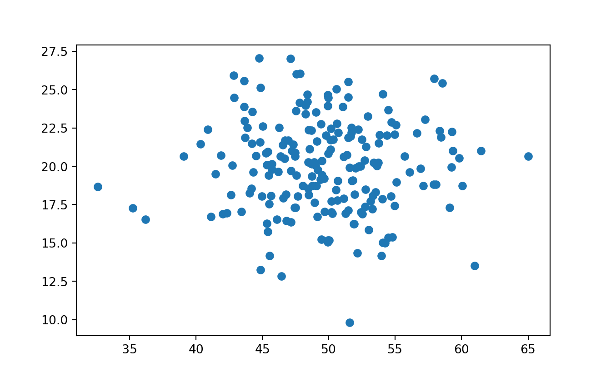
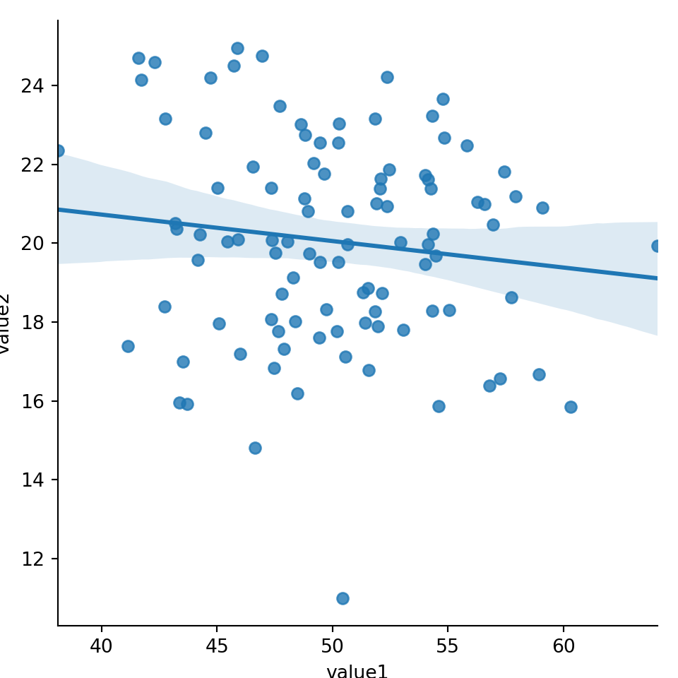
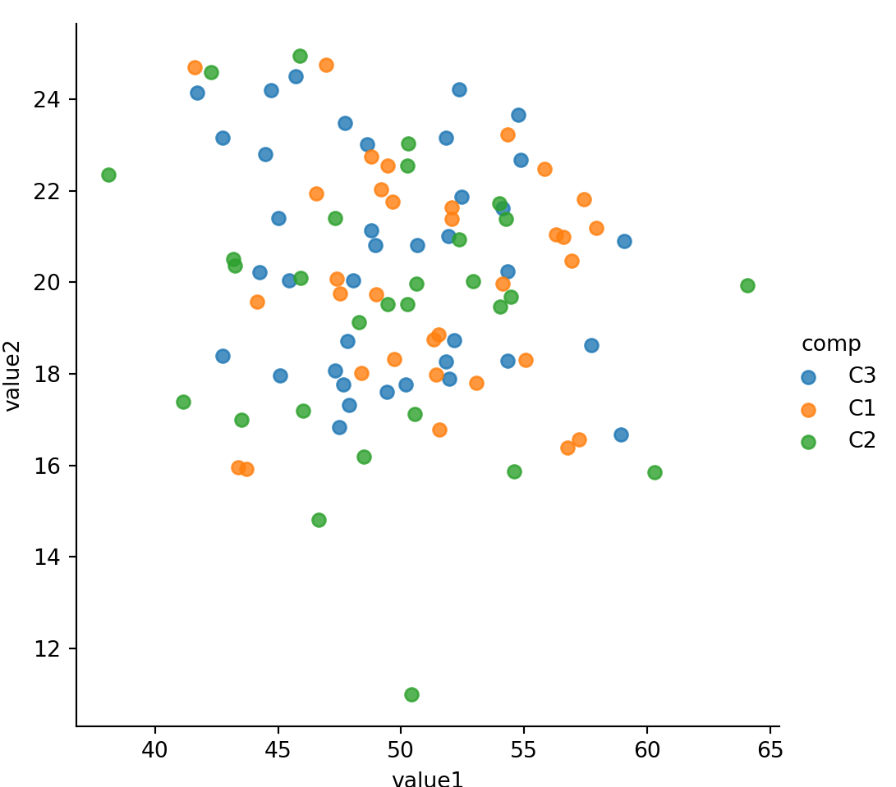
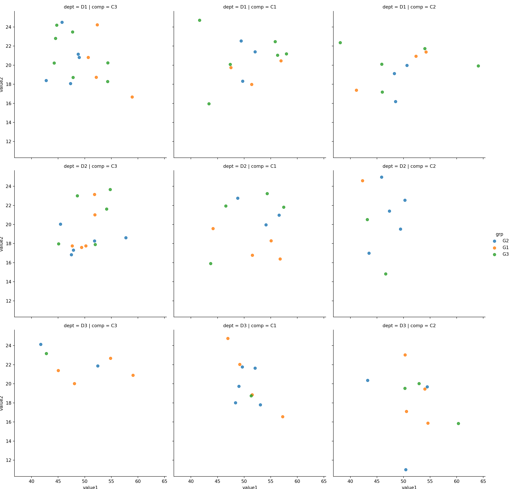
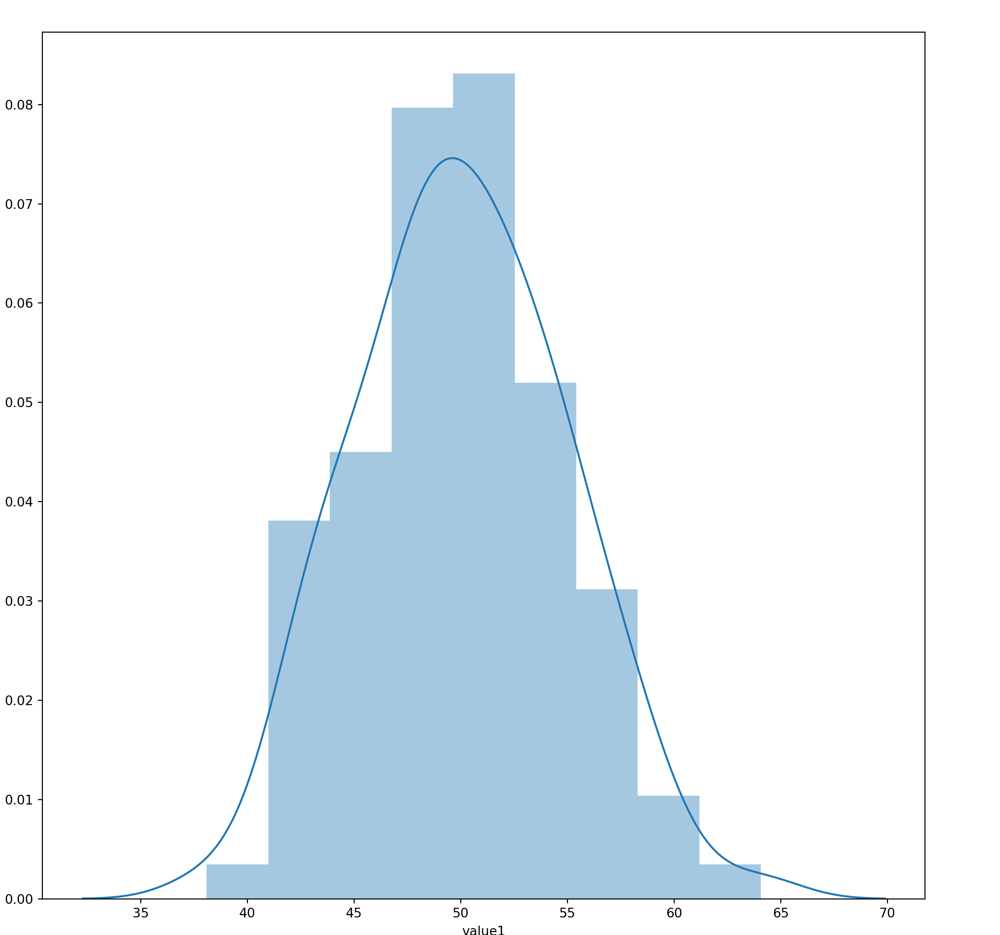
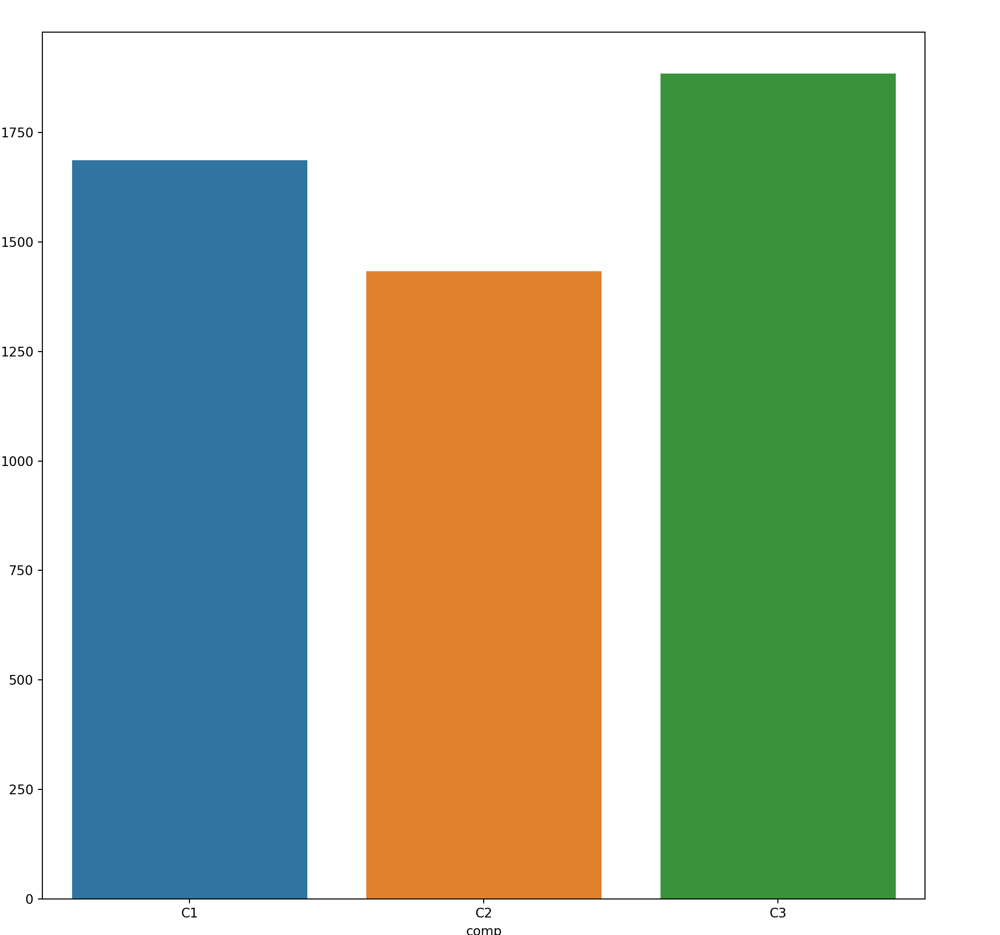
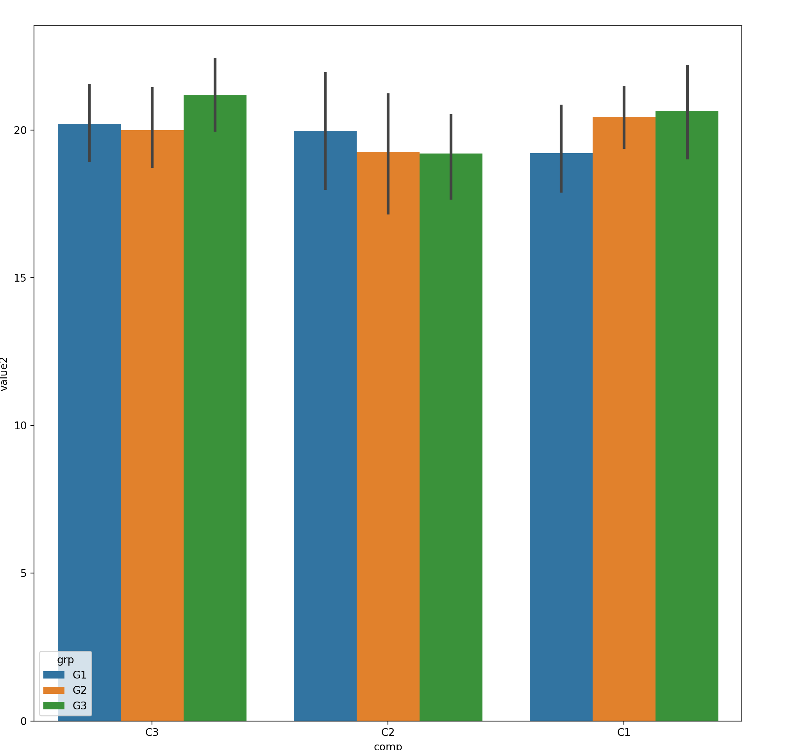
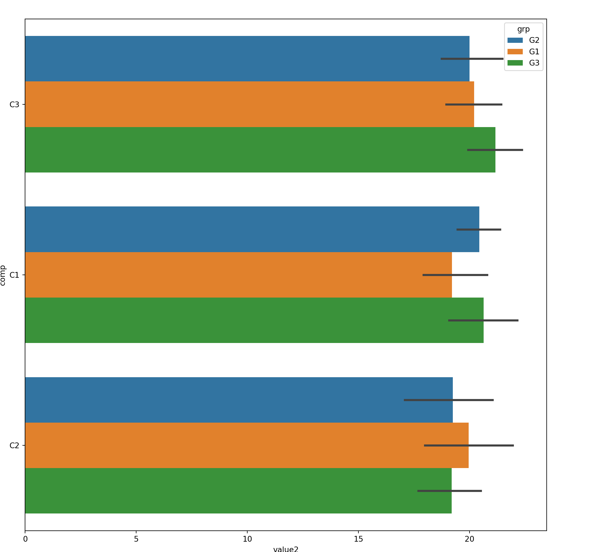
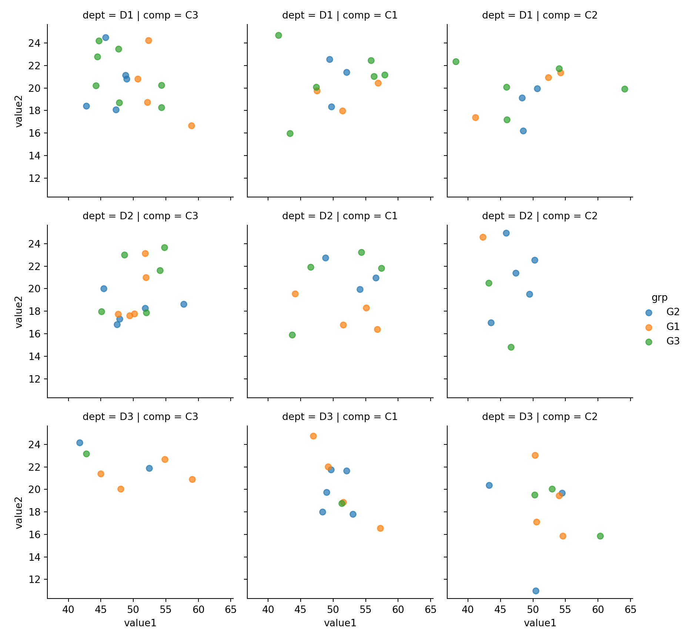
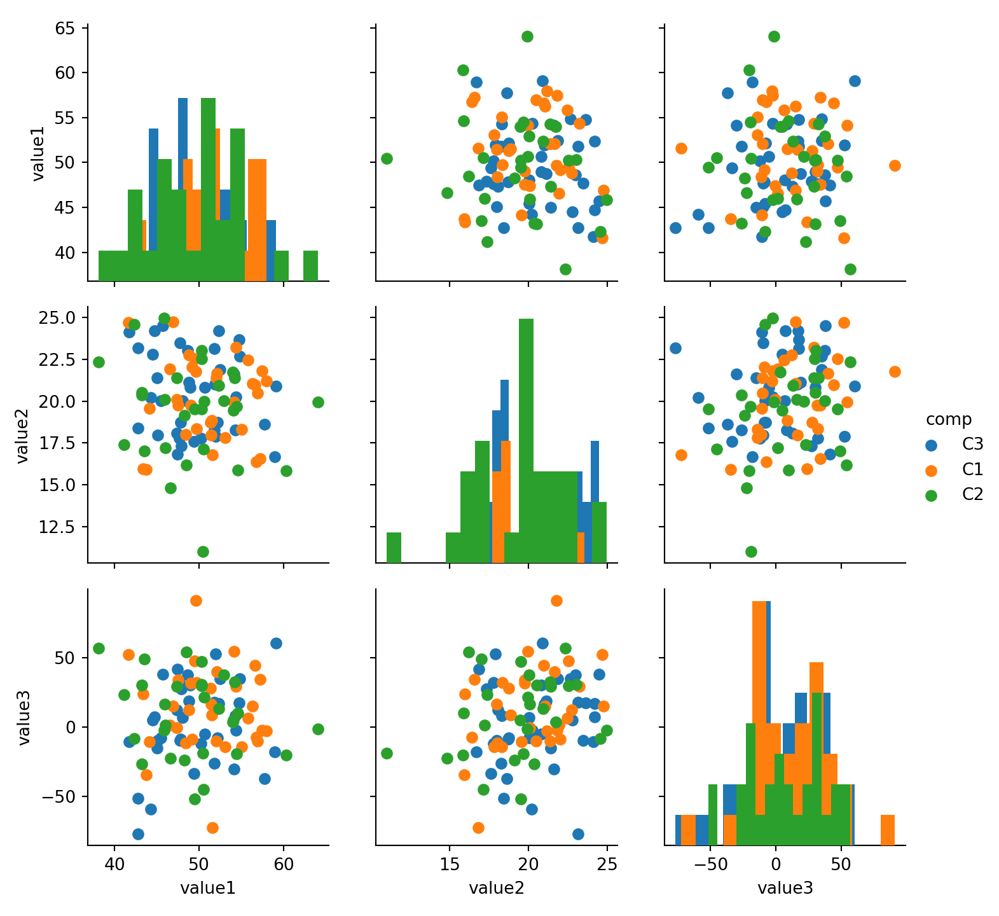

# matplotlib


## Library


```python
import matplotlib
import matplotlib.pyplot as plt
import seaborn as sns
import numpy as np

from plydata import define, query, select, group_by, summarize, arrange, head, rename
import plotnine
from plotnine import *
```

## Sample Data

This chapter uses the sample data generate with below code. The idea is to simulate two categorical-alike feature, and two numeric value feature:

- com is random character between ?C1?, ?C2? and ?C3?    
- dept is random character between ?D1?, ?D2?, ?D3?, ?D4? and ?D5?  
- grp is random character with randomly generated ?G1?, ?G2?  
- value1 represents numeric value, normally distributed at mean 50  
- value2 is numeric value, normally distributed at mean 25  


```python
n = 200
comp = ['C' + i for i in np.random.randint( 1,4, size  = n).astype(str)] # 3x Company
dept = ['D' + i for i in np.random.randint( 1,6, size  = n).astype(str)] # 5x Department
grp =  ['G' + i for i in np.random.randint( 1,3, size  = n).astype(str)] # 2x Groups
value1 = np.random.normal( loc=50 , scale=5 , size = n)
value2 = np.random.normal( loc=20 , scale=3 , size = n)
value3 = np.random.normal( loc=5 , scale=30 , size = n)

mydf = pd.DataFrame({
    'comp':comp, 
    'dept':dept, 
    'grp': grp,
    'value1':value1, 
    'value2':value2,
    'value3':value3 })
mydf.head()
```

```
#:>   comp dept grp     value1     value2     value3
#:> 0   C2   D3  G1  51.026636  21.489369  22.290891
#:> 1   C3   D4  G1  49.082037  15.141123  17.921190
#:> 2   C3   D2  G2  46.368699  17.170839   3.586760
#:> 3   C2   D1  G2  48.063624  18.912184 -27.006803
#:> 4   C2   D3  G2  48.430027  14.546105  60.678888
```


```python
mydf.info()
```

```
#:> <class 'pandas.core.frame.DataFrame'>
#:> RangeIndex: 200 entries, 0 to 199
#:> Data columns (total 6 columns):
#:>  #   Column  Non-Null Count  Dtype  
#:> ---  ------  --------------  -----  
#:>  0   comp    200 non-null    object 
#:>  1   dept    200 non-null    object 
#:>  2   grp     200 non-null    object 
#:>  3   value1  200 non-null    float64
#:>  4   value2  200 non-null    float64
#:>  5   value3  200 non-null    float64
#:> dtypes: float64(3), object(3)
#:> memory usage: 9.5+ KB
```

## MATLAB-like API

- The good thing about the pylab MATLAB-style API is that it is easy to get started with if you are familiar with MATLAB, and it has a minumum of coding overhead for simple plots.  
- However, I'd encourrage not using the MATLAB compatible API for anything but the simplest figures.  
- Instead, I recommend learning and using matplotlib's object-oriented plotting API. It is remarkably powerful. For advanced figures with subplots, insets and other components it is very nice to work with.

### Sample Data


```python
# Sample Data
x = np.linspace(0,5,10)
y = x ** 2
```

### Single Plot


```python
plt.figure()
plt.xlabel('x')
plt.ylabel('y')
plt.plot(x,y,'red')
plt.title('My Good Data')
plt.show()
```


### Multiple Subplots
Each call lto **subplot()** will create a new container for subsequent plot command 


```python
plt.figure()
plt.subplot(1,2,1) # 1 row, 2 cols, at first box
plt.plot(x,y,'r--')
plt.subplot(1,2,2) # 1 row, 2 cols, at second box
plt.plot(y,x,'g*-')
plt.show()
```


## Object-Oriented API

### Sample Data


```python
# Sample Data
x = np.linspace(0,5,10)
y = x ** 2
```

### Single Plot
**One figure, one axes**


```python
fig = plt.figure()
axes = fig.add_axes([0,0,1,1]) # left, bottom, width, height (range 0 to 1)
axes.plot(x, y, 'r')
axes.set_xlabel('x')
axes.set_ylabel('y')
axes.set_title('title')
plt.show()
```


### Multiple Axes In One Plot
- This is still considered a **single plot**, but with **multiple axes**


```python
fig = plt.figure()
ax1 = fig.add_axes([0, 0, 1, 1])         # main axes
ax2 = fig.add_axes([0.2, 0.5, 0.4, 0.3]) # inset axes

ax1.plot(x,y,'r')
ax1.set_xlabel('x')
ax1.set_ylabel('y')

ax2.plot(y, x, 'g')
ax2.set_xlabel('y')
ax2.set_ylabel('x')
ax2.set_title('insert title')
plt.show()
```


### Multiple Subplots
- One **figure**  can contain multiple **subplots**  
- Each subplot has **one axes**


#### Simple Subplots - all same size 
- subplots() function return axes object that is iterable.  

**Single Row Grid**  
Single row grid means axes is an 1-D array. Hence can use **for** to iterate through axes


```python
fig, axes = plt.subplots( nrows=1,ncols=3 )
print (axes.shape)
```

```python
for ax in axes:
    ax.plot(x, y, 'r')
    ax.set_xlabel('x')
    ax.set_ylabel('y')
    ax.set_title('title')
    ax.text(0.2,0.5,'One')
plt.show()
```


**Multiple Row Grid**  
Multile row grid means axes is an 2-D array. Hence can use two levels of **for** loop to iterate through each row and column


```python
fig, axes = plt.subplots(2, 3, sharex='col', sharey='row')
print (axes.shape)
```

```python
for i in range(axes.shape[0]):
    for j in range(axes.shape[1]):
        axes[i, j].text(0.5, 0.5, str((i, j)),
                      fontsize=18, ha='center')
plt.show()
```


#### Complicated Subplots - different size
- **GridSpec** specify grid size of the figure  
- Manually specify each subplot and their relevant grid position and size


```python
plt.figure(figsize=(5,5))
grid = plt.GridSpec(2, 3, hspace=0.4, wspace=0.4)
plt.subplot(grid[0, 0])  #row 0, col 0
plt.subplot(grid[0, 1:]) #row 0, col 1 to :
plt.subplot(grid[1, :2]) #row 1, col 0:2 
plt.subplot(grid[1, 2]); #row 1, col 2
plt.show()
```


```python
plt.figure(figsize=(5,5))
grid = plt.GridSpec(4, 4, hspace=0.8, wspace=0.4)
plt.subplot(grid[:3, 0])    # row 0:3, col 0
plt.subplot(grid[:3, 1: ])  # row 0:3, col 1:
plt.subplot(grid[3, 1: ]);  # row 3,   col 1:
plt.show()
```


**-1 means last row or column**


```python
plt.figure(figsize=(6,6))
grid = plt.GridSpec(4, 4, hspace=0.4, wspace=1.2)
plt.subplot(grid[:-1, 0 ])  # row 0 till last row (not including last row), col 0
plt.subplot(grid[:-1, 1:])  # row 0 till last row (not including last row), col 1 till end
plt.subplot(grid[-1, 1: ]); # row last row, col 1 till end
plt.show()
```


### Figure Customization

#### Avoid Overlap - Use tight_layout()
Sometimes when the figure size is too small, plots will overlap each other. 
- **tight_layout()** will introduce extra white space in between the subplots to avoid overlap.  
- The figure became wider.


```python
fig, axes = plt.subplots( nrows=1,ncols=2)
for ax in axes:
    ax.plot(x, y, 'r')
    ax.set_xlabel('x')
    ax.set_ylabel('y')
    ax.set_title('title')
fig.tight_layout() # adjust the positions of axes so that there is no overlap
plt.show()
```


#### Avoid Overlap - Change Figure Size


```python
fig, axes = plt.subplots( nrows=1,ncols=2,figsize=(12,3))
for ax in axes:
    ax.plot(x, y, 'r')
    ax.set_xlabel('x')
    ax.set_ylabel('y')
    ax.set_title('title')
plt.show()
```


#### Text Within Figure


```python
fig = plt.figure()
fig.text(0.5, 0.5, 'This Is A Sample',fontsize=18, ha='center');
axes = fig.add_axes([0,0,1,1]) # left, bottom, width, height (range 0 to 1)
plt.show()
```


### Axes Customization

#### Y-Axis Limit


```python
fig = plt.figure()
fig.add_axes([0,0,1,1], ylim=(-2,5));
plt.show()
```


#### Text Within Axes


```python
fig, ax = plt.subplots(2, 3, sharex='col', sharey='row')
for i in range(2):
    for j in range(3):
        ax[i, j].text(0.5, 0.5, str((i, j)),
                      fontsize=18, ha='center')
plt.show()
```


```python
plt.text(0.5, 0.5, 'one',fontsize=18, ha='center')
plt.show()
```


#### Share Y Axis Label


```python
fig, ax = plt.subplots(2, 3, sharex='col', sharey='row') # removed inner label
plt.show()
```


#### Create Subplot Individually
Each call lto **subplot()** will create a new container for subsequent plot command 


```python
plt.subplot(2,4,1)
plt.text(0.5, 0.5, 'one',fontsize=18, ha='center')

plt.subplot(2,4,8)
plt.text(0.5, 0.5, 'eight',fontsize=18, ha='center')
plt.show()
```


**Iterate through subplots (ax) to populate them**


```python
fig, ax = plt.subplots(2, 3, sharex='col', sharey='row')
for i in range(2):
    for j in range(3):
        ax[i, j].text(0.5, 0.5, str((i, j)),
                      fontsize=18, ha='center')
plt.show()
```


## Histogram


```python
plt.hist(mydf.value1, bins=12);
plt.show()
```


## Scatter Plot


```python
plt.scatter(mydf.value1, mydf.value2)
plt.show()
```




## Bar Chart


```python
com_grp = mydf.groupby('comp')
grpdf = com_grp['value1'].sum().reset_index()
grpdf
```


```python
plt.bar(grpdf.comp, grpdf.value1);
plt.xlabel('Company')
plt.ylabel('Sum of Value 1')
plt.show()
```


# seaborn

## Seaborn and Matplotlib
- seaborn **returns a matplotlib object** that can be modified by the options in the pyplot module  
- Often, these options are wrapped by seaborn and  .plot() in pandas and available as arguments

## Sample Data


```python
n = 100
comp = ['C' + i for i in np.random.randint( 1,4, size  = n).astype(str)] # 3x Company
dept = ['D' + i for i in np.random.randint( 1,4, size  = n).astype(str)] # 5x Department
grp =  ['G' + i for i in np.random.randint( 1,4, size  = n).astype(str)] # 2x Groups
value1 = np.random.normal( loc=50 , scale=5 , size = n)
value2 = np.random.normal( loc=20 , scale=3 , size = n)
value3 = np.random.normal( loc=5 , scale=30 , size = n)

mydf = pd.DataFrame({
    'comp':comp, 
    'dept':dept, 
    'grp': grp,
    'value1':value1, 
    'value2':value2,
    'value3':value3 
})
mydf.head()
```

```
#:>   comp dept grp     value1     value2     value3
#:> 0   C1   D2  G1  54.362552  16.563964 -31.506800
#:> 1   C3   D3  G1  53.437317  19.650167   0.222697
#:> 2   C3   D2  G1  42.885269  19.606917  -0.579869
#:> 3   C1   D3  G3  55.285004  21.801238  13.725993
#:> 4   C3   D3  G3  43.828592  22.665855 -25.880079
```

## Scatter Plot
### 2x Numeric


```python
sns.lmplot(x='value1', y='value2', data=mydf)
```

```python
plt.show()
```




```python
sns.lmplot(x='value1', y='value2', fit_reg=False, data=mydf);  #hide regresion line
```

```python
plt.show()
```


### 2xNumeric + 1x Categorical
Use **hue** to represent additional categorical feature


```python
sns.lmplot(x='value1', y='value2', data=mydf, hue='comp', fit_reg=False);
plt.show()
```



### 2xNumeric + 2x Categorical
Use **col** and **hue** to represent two categorical features


```python
sns.lmplot(x='value1', y='value2', col='comp',hue='grp', fit_reg=False, data=mydf);
plt.show()
```


### 2xNumeric + 3x Categorical
Use **row, col** and **hue** to represent three categorical features


```python
sns.lmplot(x='value1', y='value2', row='dept',col='comp', hue='grp', fit_reg=False, data=mydf);
```

```python
plt.show()
```



### Customization

#### size
size: **height** in inch for each facet


```python
sns.lmplot(x='value1', y='value2', col='comp',hue='grp', size=3,fit_reg=False, data=mydf)
```

```python
plt.show()
```


Observe that even **size is very large**, lmplot will **fit (shrink) everything into one row** by deafult. See example below.


```python
sns.lmplot(x='value1', y='value2', col='comp',hue='grp', size=5,fit_reg=False, data=mydf)
```

```python
plt.show()
```


#### col_wrap

To avoid lmplot from shrinking the chart, we use **col_wrap=<col_number** to wrap the output.  
Compare the size (height of each facet) with the above **without** col_wrap. Below chart is larger.


```python
sns.lmplot(x='value1', y='value2', col='comp',hue='grp', size=5, col_wrap=2, fit_reg=False, data=mydf)
```

```python
plt.show()
```


## Histogram
```
seaborn.distplot(
  a,               # Series, 1D Array or List
  bins=None,
  hist=True,
  rug = False,
  vertical=False
)
```

### 1x Numeric


```python
sns.distplot(mydf.value1)
plt.show()
```




```python
sns.distplot(mydf.value1,hist=True,rug=True,vertical=True, bins=30,color='g')
plt.show()
```


## Bar Chart


```python
com_grp = mydf.groupby('comp')
grpdf = com_grp['value1'].sum().reset_index()
grpdf
```

```
#:>   comp       value1
#:> 0   C1  1210.730503
#:> 1   C2  2147.078480
#:> 2   C3  1660.070827
```

### 1x Categorical, 1x Numeric


```python
sns.barplot(x='comp',y='value1',data=grpdf)
plt.show()
```



### Customization

#### Ordering


```python
sns.barplot(x='comp',y='value2', hue='grp',
            order=['C3','C2','C1'],
            hue_order=['G1','G2','G3'],
            data=mydf
)
plt.show()
```



#### Flipping X/Y Axis


```python
sns.barplot(x='value2',y='comp', hue='grp',data=mydf)
plt.show()
```



## Faceting
Faceting in Seaborn is a generic function that works with matplotlib various plot utility.  
It support matplotlib as well as seaborn plotting utility. 

### Faceting Histogram


```python
g = sns.FacetGrid(mydf, col="comp", row='dept')
g.map(plt.hist, "value1")
```

```python
plt.show()
```


```python
g = sns.FacetGrid(mydf, col="comp", row='dept')
g.map(plt.hist, "value1")
```

```python
plt.show()
```


### Faceting Scatter Plot


```python
g = sns.FacetGrid(mydf, col="comp", row='dept',hue='grp')
g.map(plt.scatter, "value1","value2",alpha=0.7);
g.add_legend()
```

```python
plt.show()
```



## Pair Grid


### Simple Pair Grid


```python
g = sns.PairGrid(mydf, hue='comp')
g.map(plt.scatter);
g.add_legend()
```

```python
plt.show()
```


### Different Diag and OffDiag


```python
g = sns.PairGrid(mydf, hue='comp')
g.map_diag(plt.hist, bins=15)
```

```python
g.map_offdiag(plt.scatter)
```

```python
g.add_legend()
```

```python
plt.show()
```




